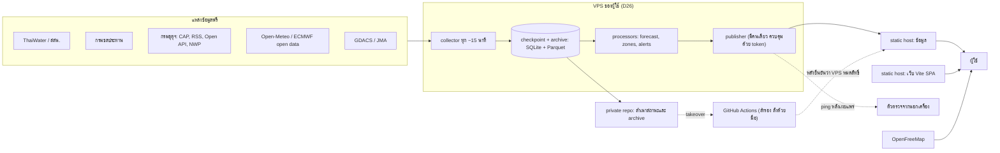

# fontokmai (ฝนตกไหม) — เอกสารออกแบบฉบับรวม v6.1

> **สถานะ**: v6.1 = v6 ที่ปิดรายละเอียด F1–F5 จากรีวิว v6 ของ Codex (`private/handoffs/2026-09-25-codex-v6-review.md`) · อัปเดต 2026-09-25 (Claude) · D26 ตกลงแล้วตามเงื่อนไขข้อ 4.3–4.5 และ 4.9 · **P0 เริ่มแล้ว**: P0-A (repo, สัญญา v1, TMD CAP slice) ตามแผน `docs/superpowers/plans/2026-09-25-p0a-foundation-cap-slice.md`
> **ประวัติ**: v1–v4 และรีวิวทั้งหมดอยู่ใน `private/handoffs/` · แหล่งข้อมูลและสิทธิ์อยู่ที่ `docs/sources.md`
> **ป้าย**: **[ผู้ใช้ตัดสิน]** · **[ตกลงแล้ว]** = Claude และ Codex ตกลงกันตาม D20 · **[เสนอ]** = รอ Codex ตรวจ

## 0. สิ่งที่เปลี่ยน
**v6.1 (ตามรีวิว v6 ของ Codex)**
- F1 ความต่อเนื่องของ feed หลังกู้คืน และขอบเขตสิทธิ์ของ token (4.4) · F2 reserve ของดิสก์มาก่อนเกณฑ์หยุด (4.9) · F3 เกณฑ์ P และความครอบคลุมของ S ในแถวคลอง (7.5) · F4 ความครบของหน้าต่าง, t0, freshness และโมเดลเดียว (7.5) · F5 private ไม่ใช่ใบอนุญาต และขอบเขต archive ที่ใช้วัดความแม่นได้ (3, 4.5, 4.9, 6.3, 15)
- TLS ของ `www.tmd.go.th` ส่งใบรับรองไม่ครบสาย: collector แนบใบกลางสาธารณะโดยไม่ปิดการตรวจ (9.2)
- **สิทธิ์ข้อมูล สสน. และสถานะดิสก์ (3, 4.9, 5, 12)**: ชุดข้อมูลเปิดของ สสน. เป็น CC BY-NC จึงใช้ทำประวัติของสถานี สสน. ได้ แต่ API หลังบ้านของ ThaiWater ยังต้องขออนุญาต · retention และตัวคุมดิสก์ยังไม่ได้ทำ จึงห้ามเพิ่มแหล่งใหญ่ก่อน
- **ไอเดียจาก Thailand Water Watch (7.4, 12)**: ผู้ใช้แนะนำ · รับเฉพาะแนวคิดการแสดงผลและการจัดการข้อมูล ไม่ใช้ข้อมูลหรือโค้ดของเขา
- **D27 (ผู้ใช้ตัดสิน)**: ขอข้อมูลเฉพาะช่องทางที่หน่วยงานเปิดรับจริง · ThaiWater API จึงไม่ใช้ในบริการจริง และข้อมูล กทม. มาทาง DXS

**v6 (ตามรีวิว v5 ของ Codex)**
- **Publisher (4.4)**: สลับเครื่องแบบ manual และต้องยืนยันว่าผู้เขียนเดิมหมดสิทธิ์ (หยุด publisher หรือเพิกถอน token) ก่อนผู้เขียนใหม่เผยแพร่ มี `owner_epoch`, runbook takeover/failback และไม่สลับกลับอัตโนมัติ
- **การกู้คืน (4.5)**: แยก RPO ของโปรแกรม crash (ไม่เกินรอบที่ยังไม่ commit) ออกจากเครื่องเสีย (ตั้งแต่สำเนานอกเครื่องล่าสุดที่สำเร็จ) กำหนดลำดับเขียนไฟล์ backup SQLite แบบ Online Backup และเก็บสำเนาใน private repo
- **ทรัพยากรและดิสก์ (4.3, 4.9)**: งบรวมของ fontokmai บังคับด้วย systemd slice, admission cutoff ก่อนช่วงห้ามรัน, งบดิสก์ทั้งระบบ retention รายชนิด และตัวตรวจจากนอกเครื่อง
- **กฎ v0 (7.5)**: เขียนใหม่ด้วยหน้าต่างเวลาที่ชัด (0–6 ชม. ไม่ใช้ฝน 24 ชม.), ตรรกะสามค่าพร้อมวงเล็บ, อินพุตรายแขนง, ฐานเปราะบาง `H`, mapping สถานีตัวแทน, QC ที่ไม่ใช้ “ไม่มีฝน” เป็นเหตุ, ระดับคลองเป็นหลักฐาน ณ จุดวัด, hysteresis และ provenance ของเกณฑ์
- **CAP (9.2)**: อ่าน RSS index แล้วตามลิงก์ไป XML รายฉบับ แยก message กับ event, ใช้เฉพาะ Actual/Public, มีสถานะรอมีผล, แปลงลำดับพิกัด และรักษาวงจร Update/Cancel
- **P0 แหล่งแรก (3)**: ทดสอบการเผยแพร่จริงด้วย TMD CAP/RSS ที่สิทธิ์ชัด ส่วน ThaiWater ทำ adapter/fixture และเก็บ archive แบบ private จนกว่าจะได้สิทธิ์จาก สสน.
- **สถานะล่าสุด**: ผู้ใช้อัปเดต VPS แล้ว มีบัญชี GitHub/Cloudflare และสมัคร NWP แล้ว · key ตัวอย่างของ TMD API ไม่ใช่ dependency ของบริการจริง · รายละเอียดเครื่องย้ายออกจากเอกสารนี้ไปบันทึก private
- **Repo สาธารณะ (4.8)**: แยกประวัติเต็มและข้อมูลเครื่องไป private repo ก่อน push ครั้งแรก และแยกสิทธิ์ผลที่เราสร้างออกจากสิทธิ์ของ input (เช่น ODbL)
- **ทดสอบ (13)**: เพิ่มกรณีทดสอบจากรีวิว v5

**v5 (ตามรีวิว v4)**
- **VPS ของผู้ใช้** เป็นเครื่องเก็บและคำนวณข้อมูลหลัก ส่วน GitHub Actions เป็นทางสำรอง (D26) ซึ่งแก้ข้อกังวลของ Codex เรื่องข้อกำหนดของ Actions และปัญหาที่ runner ไม่มีที่เก็บถาวร
- **เว็บใช้ Vite + React + TypeScript แบบ SPA** และแยกการเผยแพร่เว็บออกจากการเผยแพร่ข้อมูล
- **สัญญาไฟล์ข้อมูล** เพิ่ม manifest/`generation_id`, เวลาและ QC ครบชุด, `geometry_version`, และแยก summary ออกจาก series
- **โซนน้ำท่วม** แยก `observation` ออกจาก `forecasts[]` เพิ่ม `data_status` เขียนกฎ v0 เป็นตาราง และกำหนดเกณฑ์ v0 → v1 แบบใช้เหตุการณ์
- **Median** เป็นค่าตั้งต้นแบบทดลอง และนับตามโมเดลกับรอบจริง ไม่ใช่ตามผู้ให้บริการ
- **Alerts** มี lifecycle, revision, cursor, tombstone, `targets[]` และ `notify_eligible` และใช้ CAP ของกรมอุตุฯ เป็นแหล่งหลักของประกาศทางการ
- **License** ใช้ PolyForm Noncommercial 1.0.0 กับโค้ด และ CC BY-NC 4.0 กับเนื้อหาและข้อมูลที่เราสร้าง
- **ข่าว** แม้ไม่ใช้ AI ก็ยังผิดได้ จึงต้องเก็บ source span และเวลาของเหตุการณ์

## 1. เป้าหมาย ข้อจำกัด และหลักการ

### 1.1 สิ่งที่ผู้ใช้ต้องการ [ผู้ใช้ตัดสิน]
เว็บภาษาไทยที่ดูง่าย รวมข้อมูลฝน น้ำ และพายุของไทยไว้ที่เดียว โดยเน้น
1. ติดตามน้ำท่วมแบบสด
2. คาดปริมาณฝนล่วงหน้า 7 วันจากหลายแหล่งรวมกัน
3. คาดโซนที่น้ำจะท่วมตั้งแต่เฟสแรก
4. ปริมาณน้ำในเขื่อนและคลอง การระบาย พายุ ประกาศเตือน ค้นหาระดับตำบล favorite CCTV และข่าวสั้น
5. การแจ้งเตือนส่งจริงทีหลังได้ แต่ระบบต้องรองรับตั้งแต่แรก

### 1.2 ข้อจำกัด
| เรื่อง | ข้อกำหนด |
|---|---|
| ค่าใช้จ่าย | ไม่ใช่เชิงพาณิชย์ ไม่มีเงินทุน ต้องไม่มีค่าใช้จ่ายเพิ่ม (D12) ส่วน VPS ที่ผู้ใช้จ่ายรายปีไว้แล้วใช้ได้โดยไม่เพิ่มต้นทุน (D26) |
| ผู้เชี่ยวชาญ | ไม่มี Claude และ Codex เป็นทีมวิเคราะห์ จึงต้องชดเชยด้วย backtest และความโปร่งใส (ข้อ 7.9) |
| ผู้ใช้เว็บ | ไม่ต้อง login และใช้ภาษาไทยก่อน |
| ชื่อ | fontokmai (ฝนตกไหม) → `fontokmai.pages.dev` และ repo `github.com/dizconnectz/fontokmai` |
| พื้นที่นำร่อง | กทม. และปริมณฑล (นนทบุรี ปทุมธานี สมุทรปราการ นครปฐม สมุทรสาคร) เน้นรังสิตและคลองหลวง (อ.ธัญบุรี อ.คลองหลวง อ.ลำลูกกา) |
| License | โค้ด PolyForm Noncommercial 1.0.0 และเนื้อหา/ข้อมูลที่เราสร้าง CC BY-NC 4.0 โดยเครดิต “fontokmai by Takuma” (D25) |

### 1.3 หลักการ
1. **ทางการมาก่อน**: ประกาศของหน่วยงานแยกจากค่าที่ระบบประเมินและแสดงก่อนเสมอ ระบบไม่ออกคำสั่งอพยพ
2. **ทุกค่ามีแหล่งที่มา เวลา และช่วงสะสม** และข้อมูลที่เก่าเกินต้องติดป้าย
3. **ไม่มีข้อมูลไม่ได้แปลว่าปลอดภัย** จึงต้องมี `unknown` และ `stale` แยกจากสถานะปกติ
4. **แสดงความไม่แน่นอนตรงๆ** และไม่แสดงเปอร์เซ็นต์ความมั่นใจที่ระบบตั้งขึ้นเองโดยไม่มีหลักฐาน
5. **ใช้เฉพาะข้อมูลที่มีสิทธิ์ใช้** และให้เครดิตทุกแหล่ง (ข้อมูลกรมอุตุฯ ต้องระบุ “กรมอุตุนิยมวิทยา” ทุกครั้ง)
6. **ฟรีแต่ทนทาน**: มีทางสำรองและย้ายที่ได้ และแสดงสถานะ “ข้อมูลไม่อัปเดต” เมื่อระบบเก็บข้อมูลหยุด

## 2. การตัดสินใจ
| ID | เรื่อง | ข้อสรุป | สถานะ |
|---|---|---|---|
| D11 | การทำงานร่วม | Claude กับ Codex สื่อสารผ่าน AGENTS.md | ผู้ใช้ตัดสิน |
| D12 | งบประมาณ | ไม่ใช่เชิงพาณิชย์ ฟรีทั้งหมด | ผู้ใช้ตัดสิน |
| D13 | ขอบเขตเฟสแรก | รุ่นแรกเล็ก แต่ต้องมีการติดตามน้ำท่วม การคาดปริมาณฝน และการคาดโซนน้ำท่วม อย่างน้อยในพื้นที่นำร่อง | ผู้ใช้ตัดสิน |
| D14 | แหล่งพยากรณ์ | ECMWF + ข้อมูลฟรีของกรมอุตุฯ + แหล่งฟรีอื่น รวมหลายแหล่ง | ผู้ใช้ตัดสิน |
| D15 | พื้นที่นำร่อง | กทม. และปริมณฑล เน้นรังสิตและคลองหลวง | ผู้ใช้ตัดสิน |
| D16 | ผู้เชี่ยวชาญ | ไม่มี Claude และ Codex ช่วยวิเคราะห์ | ผู้ใช้ตัดสิน |
| D17 | ชื่อ | fontokmai (`fontokmai.pages.dev`, repo `github.com/dizconnectz/fontokmai`) | ผู้ใช้ตัดสิน |
| D18 | แจ้งเตือน | ส่งจริงทีหลัง แต่ออกแบบรองรับตั้งแต่ P1 | ผู้ใช้ตัดสิน |
| D19 | ผู้ใช้เว็บ | ไม่ต้อง login และใช้ภาษาไทยก่อน | ผู้ใช้ตัดสิน |
| D20 | เรื่องเทคนิค | Claude กับ Codex ตกลงกันเองแล้วรายงาน | ผู้ใช้ตัดสิน |
| D22 | การเปิดโค้ด | public repo | ผู้ใช้ตัดสิน |
| D23 | ข่าว | P1 ไม่ใช้ AI และทดลอง Typhoon แบบเงียบ เปิดใช้เมื่อผ่าน eval | ผู้ใช้ตัดสิน |
| D24 | การแบ่งงาน | Claude: repo, CI, collector, โมเดล, สัญญาไฟล์ข้อมูล / Codex: เว็บ, แผนที่, การแสดงอักษรไทย, E2E / ผลัดกันแก้สัญญาทีละคน | ผู้ใช้ตัดสิน (Q10) และ Codex ยืนยัน |
| D25 | License | โค้ด PolyForm Noncommercial 1.0.0 + เนื้อหา/ข้อมูลที่เราสร้าง CC BY-NC 4.0 + Required Notice “fontokmai by Takuma” | ผู้ใช้ตัดสิน |
| D21 | สถาปัตยกรรม | static: Vite SPA + ไฟล์ข้อมูลบน static host โดยแยกการเผยแพร่เว็บกับข้อมูล | ตกลงแล้ว (Codex รีวิว v4) |
| D26 | ที่รันระบบเก็บข้อมูล | VPS ของผู้ใช้ (จ่ายรายปีแล้ว) เป็น collector/processor/archive หลัก ไม่เปิดพอร์ตสาธารณะใน P1 ไม่รบกวนงานเดิมบนเครื่อง และใช้ GitHub Actions เป็นทางสำรองที่สั่งด้วยมือ (สเปกเครื่องอยู่ในบันทึก private) | ตกลงแล้ว (Codex รีวิว v5) ตามเงื่อนไขข้อ 4.3–4.5 และ 4.9 |
| D27 | การขอข้อมูลจากหน่วยงาน | ขอข้อมูลเฉพาะผ่านช่องทางที่หน่วยงานเปิดรับจริง (ระบบสมัครหรือลงทะเบียน) ไม่ส่งจดหมายหรือข้อความขออนุญาตทั่วไป · แหล่งที่ไม่มีช่องทาง ใช้ได้เฉพาะข้อมูลเปิดที่มี license หรือแสดงเป็นลิงก์ออก | ผู้ใช้ตัดสิน (2026-09-25) |

ข้อเสนอเดิม D1–D10 (FastAPI, PostgreSQL, VM เช่า, Claude API สำหรับข่าว) และ AGPL ถูกแทนแล้ว (ดูประวัติใน `private/handoffs/`)

## 3. ขอบเขตตามเฟส

### P0 — วางฐานและเริ่มเก็บข้อมูล [ตกลงแล้ว]
เหตุผลที่เริ่มเก็บข้อมูลก่อน: ยังเป็นฤดูฝน, ประวัติเซนเซอร์น้ำท่วมถนนดึงย้อนหลังไม่ได้ในการลองครั้งแรก และ ECMWF เก็บไฟล์ไว้แค่ 2–3 วัน

**ลำดับงาน**
1. **ผู้ใช้** (ทำแล้ว 2026-09-25): อัปเดตความปลอดภัยของ VPS และรีสตาร์ตนอกช่วงห้ามรัน · ใช้บัญชี GitHub `dizconnectz` และบัญชี Cloudflare ที่มีอยู่ · สมัคร TMD NWP API แล้ว (สร้าง token ใหม่ตอนติดตั้งบน VPS) · TMD API แบบ `uid`/`ukey` สมัครผ่านหน้าที่ลิงก์ถูกซ่อนแล้วยังไม่ได้รับการยืนยัน จึงไม่เป็น dependency
2. **Claude — เตรียม repo สาธารณะ**: เก็บประวัติเต็ม (`private/handoffs/`) และบันทึกเครื่อง (`private/`) ไว้ใน private repo แยกก่อน push ครั้งแรก, ทำเอกสาร public ให้ไม่มีรายละเอียดเครื่อง, ตั้ง `.gitignore` และ secret scan ใน CI, ตรวจ LICENSE/NOTICE และเครดิต (ข้อ 4.8)
3. **Claude**: repo + CI + schema ขั้นต่ำ (manifest, observation ของสถานี, alerts) + สัญญา publication/checkpoint ขั้นต่ำ + ที่เก็บ secret (GitHub Secrets และ `.env` บน VPS นอก repo)
4. **Claude — vertical slice ที่เผยแพร่ได้**: TMD CAP + RSS (สิทธิ์ชัด) → QC → checkpoint → archive chunk → publish snapshot พร้อมทดสอบ crash/recovery และวงจร CAP (ข้อ 9.2)
5. **Claude — ThaiWater คู่ขนาน**: ตรวจเงื่อนไขการจัดเก็บ ประมวลผล และสำรองนอกเครื่องก่อน แล้วทำ adapter + fixtures และเก็บ archive (ฝน, เซนเซอร์น้ำท่วมถนน, ระดับน้ำคลอง) เฉพาะตามสิทธิ์ที่ตรวจได้ เพราะ private เป็นการจำกัดผู้เข้าถึง ไม่ใช่ใบอนุญาต · ยังไม่เผยแพร่จนกว่าจะได้สิทธิ์จาก สสน. (ขอได้เฉพาะเมื่อ สสน. เปิดช่องทางสมัคร · D27) และห้ามเผยแพร่เพียงเพราะลบชื่อแหล่ง
6. **Codex**: UI shell, แผนที่ และ consumer fixtures ตามสัญญาชุดเดียวกัน โดยจองคนละ path
7. **ร่วมกัน**: ทดลองเผยแพร่ (Cloudflare Direct Upload จาก VPS เทียบกับ GitHub Pages) วัดเพดานจริง และซ้อม takeover/failback (ข้อ 4.4), restore จากสำเนา (ข้อ 4.5), rollback และสถานะค้าง
8. **Claude**: เพิ่มแหล่งทีละชุด ได้แก่ RID, พยากรณ์ (เริ่มจากชุด query เล็ก), TMD NWP นำร่องแบบขอรายอำเภอ (ข้อ 4.3) และหาข้อมูลคลองกับการระบายของรังสิต
9. **Codex**: vertical slice สถานี/ประกาศ → แผนที่ → หน้าตำบล/รายการ → E2E บน production build และทดสอบการแสดงอักษรไทยบน OpenFreeMap ด้วยเครื่องจริงทั้ง Android Chrome และ iOS Safari

**เกณฑ์ผ่าน P0 (ตกลงก่อนเริ่มนับ 7 วัน)**
- รอบ 15 นาทีมี 672 slots ใน 7 วัน รายงานเวลา scheduled / start / fetch / เวลาวัดของต้นทาง / checkpoint / publish แยกกัน พร้อมสัดส่วนสำเร็จและความหน่วง p50/p95/max โดยนับรอบที่พลาดด้วย
- อย่างน้อย 95% ของ slots ต้องเผยแพร่ผลหรือสถานะ `degraded` ได้ภายใน 30 นาทีจากเวลาที่ควรรัน เป้านี้เป็นเกณฑ์ระบบทดลอง ไม่ใช่ SLA และไม่ใช่การรับรองว่าต้นทางสด 95% ถ้าทำไม่ได้ต้องปรับความถี่หรือสถาปัตยกรรมอย่างเปิดเผยก่อน P1
- ทดสอบกรณีต้นทาง timeout/429/schema เปลี่ยน, รอบซ้อน, เครือข่ายขาดหลัง upload, scheduler หยุด, การรีเซ็ตตอน 07:00, การกู้จาก checkpoint และข้อมูลที่สิทธิ์ยังไม่ชัดต้องไม่หลุดสู่สาธารณะ โดยต้องไม่ทำให้ข้อมูลเก่าดูใหม่ ไม่ปน snapshot คนละรุ่น และไม่เสียประวัติโดยไม่รายงาน
- ประเมินโควตารายเดือนและขนาด archive จากข้อมูลที่วัดจริง และ replay input เดิมต้องได้ผลที่ตรวจเทียบได้ด้วย hash/provenance
- มีตารางกฎ v0 (ข้อ 7.5), ทะเบียนโซนพร้อมข้อจำกัดของรังสิต, สัญญาผล observed/predicted/unknown ที่ consumer tests ผ่าน และหน้าที่แสดง “ยังไม่ได้ตรวจความแม่น” ได้ถูกต้อง (ไม่ต้องรอพิสูจน์ความแม่นของ v1)
- บันทึกพารามิเตอร์และช่วงเวลาที่ลองเรียก `flood_road_graph` จริง ไม่สรุปจากผลว่างครั้งเดียวว่าไม่มีประวัติเลย
- ซ้อม takeover และ failback แล้วไม่เกิด publisher สองตัว และ `feed_sequence` กับ alert revision ไม่ย้อน (ข้อ 4.4)
- restore จากสำเนานอกเครื่องจริงสำเร็จ พร้อมวัด RTO และรายงาน `last_backup_at` (ข้อ 4.5)
- วัดผลกระทบต่องานเดิมบน VPS ก่อนและระหว่างทดลอง (โหลด, RAM ว่าง, I/O wait, เวลาเสร็จของงานเดิม) (ข้อ 4.3)

### P1 — fontokmai รุ่นแรก
**ทั้งประเทศ**
- แผนที่ 3 โหมด (ตรวจวัดล่าสุด / พยากรณ์ / น้ำและประกาศ) พร้อมมุมมองรายการเมื่อ WebGL ใช้ไม่ได้
- สถานีฝน (“ฝนสะสม 24 ชม.” และ “ฝนตั้งแต่ 07:00” พร้อมช่วงเวลา) และสถานีระดับน้ำ พร้อมเวลาและสถานะความสด
- พยากรณ์ฝน 7 วันรายตำบลจากหลายแหล่ง (ข้อ 6) คู่กับข้อความพยากรณ์ทางการของกรมอุตุฯ
- ค้นหา หน้าตำบล และ favorite ในเครื่อง
- ประกาศทางการ (TMD CAP เป็นหลัก) และพายุ (GDACS + TMD)
- เขื่อนใหญ่บนแผนที่ อ่างขนาดกลางเป็นตาราง พร้อมปริมาณระบาย
- CCTV แบบลิงก์ออก และหน้า `/status`, `/sources`, `/method`
- ข่าว: ประกาศทางการและหัวข่าว พร้อมแท็กพื้นที่และชนิดภัย (ข้อ 10)
- feed `alerts.json` (ข้อ 9) โดยยังไม่ส่ง push

**พื้นที่นำร่อง (หัวใจของ P1)**
- ติดตามน้ำท่วมสดจากจุดที่วัดได้จริง (ข้อ 7.4)
- พยากรณ์ฝนรายชั่วโมง 48 ชม. จาก TMD WRF 2 กม. ให้ทุกตำบล/แขวงในพื้นที่นำร่อง (ประมาณ 488 แห่ง) ร่วมกับหลายโมเดล
- “ฝน 1 ชม. ล่าสุด” ที่คำนวณเองตามข้อ 7.8
- โซนเสี่ยงน้ำท่วม v0 ตามตารางข้อ 7.5 (ติดป้ายทดลอง) และพัฒนาเป็น v1 ตามเกณฑ์ข้อ 7.9
- ปริมาณน้ำฝนรายโซนหรือรายเขต (ข้อ 7.7)
- กราฟย้อนหลังของสถานีพร้อมเส้นเทียบเหตุการณ์ใหญ่ (ข้อ 12) · เริ่มเก็บประวัติระดับน้ำให้เร็วที่สุดเพราะย้อนหลังได้จำกัด

### P2
- ส่งแจ้งเตือนจริง (ข้อ 9): Web Push, LINE bot แบบถาม-ตอบ (reply ฟรี) และ LINE push ภายในโควตาฟรี
- ขยายพื้นที่นำร่อง และเพิ่มชั้นน้ำท่วมจากดาวเทียม (GISTDA, Copernicus GFM)
- หน้าความแม่นของโมเดล และถ่วงน้ำหนักตามความแม่นเมื่อผ่านเกณฑ์
- ปุ่ม “แจ้งว่าท่วมจริง” จากผู้ใช้ (ลดข้อมูลส่วนบุคคลก่อนเผยแพร่)
- TMD NWP ทั่วประเทศแบบ on-demand
- AI สรุปข่าวแบบฟรีถ้าผ่าน eval และมีสิทธิ์ส่งเนื้อหาเข้า API

### P3
- แผนที่คาดพื้นที่ท่วมแบบละเอียด ทิศทางน้ำ และเวลาที่น้ำจะมาถึง ในลุ่มน้ำที่มีข้อมูลพอ, ML และขยายทั่วประเทศ

### ไม่อยู่ในขอบเขตตอนนี้
- ความลึกน้ำรายบ้าน คำสั่งอพยพ แอปมือถือ native และระบบสมาชิก

## 4. สถาปัตยกรรม

### 4.1 ภาพรวม [D21, D26 ตกลงแล้ว]


### 4.2 ส่วนประกอบ
| ส่วน | ทำอะไร | รันที่ |
|---|---|---|
| collector | ดึงข้อมูลตามรอบ, ตรวจ QC, แปลงเวลาและหน่วย, บันทึก checkpoint | VPS (Docker) |
| processors | พยากรณ์รายตำบล, TMD NWP นำร่อง, โซนน้ำท่วม, alerts | VPS |
| publisher | ประกอบ snapshot ที่ตรวจครบแล้วและเผยแพร่ชุดข้อมูล โดยมีผู้เขียนคนเดียว | VPS |
| collector สำรอง | โค้ดชุดเดียวกัน ใช้เมื่อผู้ดูแลสั่ง takeover ตาม runbook (ข้อ 4.4) และเขียน checkpoint/chunk ไปที่สำเนานอกเครื่องทุกรอบ | GitHub Actions (สั่งด้วยมือ) |
| ที่เก็บ | SQLite (WAL) สำหรับสถานะและ checkpoint + Parquet chunk ต่อรอบพร้อม checksum | ดิสก์ VPS |
| สำเนานอกเครื่อง | รายวัน: SQLite snapshot, versions ของ method/config/schema/geometry, alert state และ chunk (ข้อ 4.5) | private GitHub repo (Releases) |
| ตัวตรวจจากนอกเครื่อง | รับ ping หลังเผยแพร่สำเร็จ และแจ้งผู้ใช้เมื่อหายเกินเกณฑ์ (ข้อ 4.9) | บริการฟรีภายนอก (ตรวจเงื่อนไขก่อน) หรือ workflow ที่ตรวจอายุ manifest |
| เว็บ | Vite + React + TypeScript + MapLibre อ่านไฟล์ข้อมูลที่มีเวอร์ชัน (อัปเดตข้อมูลไม่ต้อง rebuild เว็บ) | static host |
| แผนที่ฐาน | vector tiles | OpenFreeMap |
| Worker (P2) | รับ subscription ของการแจ้งเตือน และ LINE webhook | Cloudflare Workers + D1 หรือ VPS (ตัดสินใน P2) |

### 4.3 ตารางงานและทรัพยากรบน VPS [ตกลงแล้ว · ตัวเลขเริ่มต้น วัดจริงใน P0]
| งาน | เวลา | หมายเหตุ |
|---|---|---|
| collector (งานเบา) | ทุก 15 นาที เหลื่อมจากต้นชั่วโมง (เช่น :03, :18, :33, :48) | มี timeout และ retry จำกัด · ในช่วงห้ามรันยังทำงานด้วย `nice`/`ionice` ต่ำ ถ้าวัดแล้วพบว่ากระทบงานเดิมจึงลดความถี่ในช่วงนั้น ไม่หยุดทั้งหมดจนเสียข้อมูลโดยไม่มีเหตุผล |
| forecast ทั่วประเทศ (งานหนัก) | หลังข้อมูลรอบ 00z และ 12z พร้อม | **admission cutoff**: เริ่มได้เมื่อเวลาที่คาดว่าจะใช้ (p95 ที่วัดได้ + เผื่อ 20%) จบก่อนช่วงห้ามรัน ไม่เช่นนั้นเลื่อนไปหลังช่วง ถ้ายังทำงานอยู่เมื่อถึงช่วงห้ามรันให้ checkpoint แล้วหยุดแบบกู้คืนได้ |
| TMD NWP นำร่อง | เมื่อ endpoint ตรวจช่วงข้อมูล (ไม่นับ datapoint) บอกว่ามีรอบใหม่ | ขอรายอำเภอด้วย `subarea=1` 79 request + ขอตามพิกัดสำหรับแขวงที่ไม่มีในรายชื่อของ NWP (ประมาณ 20) + retry ≈ 100 request ใช้ราว 2 นาทีที่ ≤ 55 ครั้ง/นาที · datapoints ≈ 488 พื้นที่ × 48 ชม. × 3 ตัวแปร ≈ 70,000 ต่อรอบ (< 100,000/ชม.) จึงดึงเต็มได้ไม่เกินชั่วโมงละรอบ และอ่านงบจริงจาก header `X-Datapoint-Remaining` ก่อนเริ่ม |
| publish | ต่อจาก collector และ processors | ชุดข้อมูลต้องตรวจครบก่อนเผยแพร่ (ข้อ 4.4) |
| สำรองนอกเครื่อง / compaction (งานหนัก) | วันละครั้ง นอกช่วงห้ามรัน | ใช้ admission cutoff เดียวกัน และตรวจ checksum หลังอัปโหลด |

- **ช่วงห้ามรัน** ของงานเดิมบนเครื่องตั้งใน `.env` (`PROTECTED_WINDOW`) ไม่เขียนเวลาจริงลง repo
- **งบรวมของ fontokmai** ครอบทุก container และ subprocess (เช่นการแตก GRIB, ไฟล์ชั่วคราว, log): บังคับด้วย systemd slice (`cgroup_parent: fontokmai.slice` ที่ตั้ง `CPUQuota=200%`, `MemoryMax=2G`, `MemorySwapMax=0`, `IOWeight` ต่ำ) และตั้งเพดานราย container ไม่ให้ผลรวมเกินงบ ตั้งค่าแล้วต้องตรวจค่าที่ได้รับจริงด้วย `systemctl show`/`docker stats` เพราะ container ไม่มีเพดานเอง และ memory กับ swap ต้องคิดร่วมกัน
- **งานพร้อมกัน**: งานหนักได้ครั้งละ 1 งาน และ collector พร้อมกันได้ไม่เกิน 2 ตัว · งานหนักรันด้วย `nice 19` และ `ionice -c3`
- **วัดผลกระทบต่องานเดิม** ก่อนและระหว่างทดลอง ไม่อ้างว่างบตัวอย่างพิสูจน์แล้วว่าไม่รบกวน
- สเปก การใช้ดิสก์ และตารางงานจริงของเครื่องอยู่ในบันทึก private (`private/vps.md`) ไม่อยู่ใน repo สาธารณะ

### 4.4 การเผยแพร่ข้อมูล [ตกลงแล้ว]
1. **แยก deployment** ของเว็บ (เมื่อโค้ดเปลี่ยน) ออกจากชุดข้อมูล (ตามรอบ) และตั้ง data base URL ให้เปลี่ยน host ได้
2. **จุดเผยแพร่คือการ activate deployment**: ทุกรอบประกอบ snapshot ครบชุด (มี `generation_id`) แล้ว deploy ทั้งชุดเป็น deployment ใหม่ของ project ข้อมูล ไม่แก้ไฟล์ทีละไฟล์บน host · เก็บชุดก่อนหน้าไว้ให้แท็บที่เปิดค้างโหลดได้ครบ ถ้าไฟล์เก่าหายให้เว็บโหลด manifest ใหม่แล้วเปลี่ยนทั้งชุด
3. **Publisher มีคนเดียวเพราะควบคุมสิทธิ์ ไม่ใช่เพราะอ่านเวลาใน manifest**: VPS กับ Actions ใช้ token เผยแพร่คนละตัว (สิทธิ์เฉพาะ project ข้อมูล) Actions เผยแพร่ได้เฉพาะเมื่อผู้ดูแลสั่ง takeover พร้อม `owner_epoch` ใหม่ ส่วน snapshot ที่เก่าเกิน 45 นาทีเป็นเพียงสัญญาณให้พิจารณา takeover
4. **Runbook takeover** (VPS → Actions):
   1. ยืนยันว่า VPS หยุดเผยแพร่แล้ว: หยุด publisher บนเครื่องถ้าเข้าได้ ถ้าเข้าไม่ได้ให้ผู้ใช้**เพิกถอน token ของ VPS ที่ฝั่ง Cloudflare** ก่อน
   2. ตรวจรายการ deployment ว่าไม่มีตัวค้างหรือกำลังทำงาน แล้วบันทึก `last_accepted_generation`
   3. เพิ่ม `owner_epoch` แล้วสั่ง workflow ด้วยมือพร้อม epoch ใหม่ ทางสำรองกู้ checkpoint ล่าสุดจากสำเนานอกเครื่อง (zone state, alert ID/revision/cursor) และเริ่มต่อจาก `feed_sequence` เดิม เพื่อไม่ให้เหตุเดิมถูกแจ้งเป็นเหตุใหม่
   4. ถ้ายืนยันข้อ 1 ไม่ได้ ทางสำรองเก็บข้อมูลและเตรียม snapshot ได้ แต่**ห้ามเผยแพร่ทับปลายทางหลัก**
5. **Runbook failback** (Actions → VPS): ปิด workflow และเพิกถอน token ของ Actions → VPS นำเข้า checkpoint/chunk ที่ทางสำรองเขียนไว้ → สร้าง token ใหม่ให้ VPS → เพิ่ม `owner_epoch` → reconcile แล้วเผยแพร่ต่อ · **ไม่สลับกลับอัตโนมัติ**: publisher บน VPS ที่เพิ่งเปิดเครื่องต้องเริ่มในโหมดรอจนกว่าผู้ดูแลยืนยัน epoch ปัจจุบัน
6. **Reconcile เมื่อสถานะไม่แน่ชัด** (เช่น upload สำเร็จแต่ response หาย): ตรวจรายการ deployment ด้วย `generation_id` ก่อน ถ้าสำเร็จแล้วให้บันทึกผล ถ้าไม่สำเร็จให้ส่งชุดเดิมซ้ำแบบ idempotent ห้าม activate ชุดเก่าย้อนหลังหรือสร้าง alert revision ซ้ำ
7. **Rollback** ของโค้ดหรือ snapshot เผยแพร่เป็นรุ่นใหม่ที่ `feed_sequence` เพิ่มขึ้นเสมอ และคงเวลาข้อมูลต้นฉบับ (ข้อมูลเก่าต้องไม่ดูใหม่) โดย expiry คำนวณจากเวลาต้นทางเสมอ
8. **ถ้าจะทำอัตโนมัติในอนาคต** ต้องมีตัวกลางที่บังคับสิทธิ์การเขียนได้จริง (lease และ fencing ที่ปลายทางตรวจ) ไม่ใช่เพิ่ม field ลง JSON อย่างเดียว
9. **Host หลัก**: Cloudflare Pages แบบ Direct Upload จาก VPS โดย P0 ต้องตรวจโควตาจริงของบัญชีฟรีสำหรับ 96 ครั้ง/วัน (2,880 ครั้ง/30 วัน) ก่อนใช้ต่อเนื่อง การผ่าน 7 วันยังไม่พิสูจน์ว่าทั้งเดือนไม่ติดโควตา
10. **Host สำรอง**: GitHub Pages ผ่าน custom Actions deployment (ไซต์ไม่เกิน 1 GB, bandwidth soft limit 100 GB/เดือน, deployment ไม่เกิน 10 นาที) และต้องทดสอบ CORS, cache, compression และ 404 ก่อนสลับ
11. **ช่วงพัฒนา** เริ่มบน GitHub Pages ได้ก่อน (ใช้บัญชีเดียว) · ใช้งานแล้วตั้งแต่ 2026-09-25: VPS เผยแพร่ `/data/v1` ไปที่ `dizconnectz.github.io/fontokmai-data` ทุก 15 นาที เป็น orphan commit เดียวต่อรอบ ด้วย deploy key ที่เขียนได้เฉพาะ repo ข้อมูล (Pages ตั้ง cache 10 นาที และมี CORS `*`)
12. **Deep link ของ SPA**: ตั้ง route fallback ให้เปิด `/t/{code}` ตรงๆ ได้ และทดสอบบน host จริงทั้งสองแบบ เพราะ GitHub Pages ไม่มี rewrite แบบ Cloudflare
13. **ข้อกำหนดของ GitHub Actions**: การเป็นทางสำรองไม่ได้ยกเว้นข้อกำหนดโดยอัตโนมัติ ใช้เท่าที่จำเป็นและตรวจการใช้งานจริง
14. **ความต่อเนื่องของ feed หลังกู้คืน**: ทุก generation ที่ปลายทางยอมรับคือ high-water mark ของ `feed_sequence`, revision และ tombstones · ตอน takeover หรือ restore ให้อ่าน `manifest.json` กับ `alerts.json` ที่เผยแพร่อยู่จริงแล้วต่อค่าไม่ต่ำกว่านั้น ไม่เชื่อสำเนารายวันอย่างเดียว · ถ้ากู้สถานะล่าสุดไม่ได้ ให้เพิ่ม `recovery_epoch` (consumer ล้างสถานะแล้ว resync ตาม `contracts/v1/README.md`) และรายงานช่วงข้อมูลที่สูญ ห้ามทำให้เหตุที่ยกเลิกแล้วกลับเป็น active · การสูญประวัติตรวจวัดตาม RPO กับความต่อเนื่องของ feed เป็นคนละเรื่อง · ทดสอบกรณีที่มี cancel/update เกิดระหว่างสำเนากับค่าที่เผยแพร่
15. **ขอบเขตสิทธิ์ของ token**: token ของ Cloudflare Direct Upload ที่เอกสารแนะนำเป็นสิทธิ์ระดับบัญชี (Account → Cloudflare Pages → Edit) จึงยังแยกราย project ไม่ได้ ต้องบันทึกขอบเขตที่บัญชีรองรับจริงก่อนออก token และ runbook ต้องตรงกับ host ที่ใช้จริง รวมช่วงที่เริ่มบน GitHub Pages

### 4.5 ที่เก็บข้อมูลและการกู้คืน [ตกลงแล้ว · วัดจริงใน P0]
- **บน VPS**: SQLite (WAL) เก็บสถานะ checkpoint และดัชนี ส่วนข้อมูลที่ normalize แล้วเก็บเป็น Parquet chunk ต่อ `run_id` พร้อม checksum แล้วรวมเป็นรายวัน
- **ลำดับเขียน**: (1) เขียน chunk ลงไฟล์ชั่วคราวในโฟลเดอร์เดียวกัน (2) fsync และตรวจ checksum (3) rename เป็นชื่อถาวรแบบ atomic (4) commit ดัชนีกับ checkpoint ใน transaction เดียว (5) ประกอบ snapshot แล้ว publish (6) บันทึกผล publish
  - ตอนเริ่มโปรแกรมให้ reconcile: ไฟล์ที่ไม่มีในดัชนีเป็นไฟล์กำพร้า (ตรวจ checksum แล้วนำเข้าหรือกักไว้) ส่วนดัชนีที่ชี้ไฟล์ที่ไม่มีให้ติด `missing` แล้วดึงซ้ำถ้าต้นทางยังมี ไม่เช่นนั้นรายงานเป็นช่องว่าง
- **RPO แยกสองกรณี**
  - **โปรแกรม crash แต่ดิสก์ยังอยู่**: สูญไม่เกินรอบที่ยังไม่ commit · ทดสอบ crash 3 จุด (หลัง fetch / ก่อน commit / หลัง publish) และ replay ต้องไม่เพิ่ม record ซ้ำและไม่เปลี่ยน revision โดยไม่มีเหตุ
  - **เครื่องหรือดิสก์เสีย**: สูญตั้งแต่**สำเนานอกเครื่องล่าสุดที่สำเร็จ** (ประมาณหนึ่งวันถ้าสำรองตรงเวลา หรือมากกว่าเมื่อสำรองล้ม) · รายงาน `last_backup_at` ใน `status.json` และวัด RTO จากการซ้อม restore จริงแยกกัน
- **สำเนานอกเครื่อง** วันละครั้งไปที่ private GitHub repo ในรูป Releases (ไฟล์ละต่ำกว่า 2 GiB)
  - SQLite ใช้ Online Backup API หรือ `VACUUM INTO` เพื่อได้ snapshot ที่สอดคล้อง ห้ามคัดลอกไฟล์ `.db` ขณะมีการเขียน เพราะข้อมูลที่ commit แล้วอาจยังอยู่ใน WAL
  - มี checkpoint, versions ของ method/config/schema/geometry, alert state (ID, revision, `feed_sequence`, cursor) และ chunk ที่จำเป็นต่อการกู้
  - ไม่มี secrets · ข้อมูลที่สิทธิ์ยังไม่ชัดสำรองไป private repo ได้เฉพาะเมื่อสิทธิ์การสำรองนอกเครื่องตรวจแล้ว (private ไม่ใช่ใบอนุญาต) ห้ามเข้า repo สาธารณะ และส่วนใดที่สำรองนอกเครื่องไม่ได้ต้องระบุว่ากู้ไม่ได้เมื่อเสียทั้งเครื่อง
  - ชุดที่สิทธิ์เผยแพร่ได้อาจเผยแพร่เพิ่มใน Releases ของ repo สาธารณะ (ไม่เกิน 1,000 assets ต่อ release) โดยไม่อ้างว่าเป็นคลังฟรีตลอดไป
- **ทางสำรอง Actions**: runner ไม่มีที่เก็บถาวร ทุกรอบต้องเขียน chunk/checkpoint ไปที่ private repo และตอน failback ให้ VPS นำเข้าจากที่นั่น ไม่อาศัยหน่วยความจำของ runner หรือสำเนารายวันเก่า
- **ข้อมูลที่สิทธิ์ยังไม่ชัด** การเก็บแบบ private ไม่ได้ทำให้มีสิทธิ์เผยแพร่ และต้องไม่หลุดใน log, artifact หรือ release ของ repo สาธารณะ
- **Retention และงบดิสก์**: ดูข้อ 4.9 · ซ้อม restore จากสำเนาจริงใน P0 และบันทึก RTO

### 4.6 สัญญาไฟล์ข้อมูล [ตกลงแล้วตามรีวิว]
**ไฟล์**
```
/data/v1/manifest.json               generation_id, schema_version, generated_at, next_due_at, writer, files[] (url/hash/size/revision), source_status, complete|partial
/data/v1/status.json                 สถานะรายแหล่ง + heartbeat
/data/v1/gazetteer.json              ชื่อและรหัสพื้นที่สำหรับค้นหา
/data/v1/ref/boundaries/{version}/   ขอบเขตการปกครองพร้อม geometry_version
/data/v1/ref/zones/{version}.geojson ทะเบียนโซน
/data/v1/ref/sources.json            แหล่ง เครดิต และวิธีคำนวณ
/data/v1/ref/event_marks.json        ระดับของเหตุการณ์ใหญ่และเกณฑ์เตือนรายสถานี พร้อม source/datum
/data/v1/stations/{kind}.geojson     สรุปล่าสุดของสถานีแต่ละชนิด
/data/v1/series/{kind}/{chunk}.json  ข้อมูลย้อนหลังแยก chunk โหลดเมื่อเปิดกราฟ
/data/v1/province/{code}.json        สรุปพยากรณ์รายตำบลของจังหวัด
/data/v1/pilot/zones.json            observation + forecasts[] ของโซนนำร่อง
/data/v1/pilot/tambon/{code}.json    พยากรณ์รายชั่วโมง 48 ชม.
/data/v1/alerts.json                 feed แจ้งเตือน (ข้อ 9)
/data/v1/dams.json · storms.json · news.json · cctv.json
/data/v1/frames/{run_id}/manifest.json + ภาพ
```
**สิ่งที่ต้องมีในสัญญา**
| ส่วน | สิ่งที่ต้องมี | ป้องกันปัญหา |
|---|---|---|
| Manifest | `generation_id`, `schema_version`, `generated_at`, `next_due_at`/`expires_at`, รายการไฟล์พร้อม hash/size/revision, `source_status`, complete/partial | เว็บอ่านข้อมูลจากคนละรอบโดยไม่รู้ |
| สถานีและโซน | ID แบบมี namespace ที่คงที่, `geometry_version`, datum, `hazard`, `scope`, mapping กับตำบลและสถานีพร้อมเหตุผล | จุดวัดกลายเป็นหลักฐานของทั้งโซน หรือ ID ของหน่วยงานชนกัน |
| ค่าและเวลา | `observed_at`, `issued_at`, `available_at`/`first_seen_at` (เมื่อรู้จริง), `fetched_at`, `valid_from`/`valid_to`, duration, QC, `missing_reason`, `stale_after` | เวลาดาวน์โหลดใหม่ทำให้ข้อมูลเก่าดูสด หรือ backtest ใช้ข้อมูลอนาคต |
| ผลคำนวณ | `method_version`, `config_hash`, input IDs/revisions, `models_used`, `validation_status` | สร้างผลซ้ำหรืออธิบายที่มาไม่ได้ |
| สรุปกับประวัติ | แยก summary ออกจาก series/chunk และกำหนดขนาดจากข้อมูลจริง | ไฟล์ใหญ่เกิน (ยังรับรองขนาดต่อไฟล์ไม่ได้จนกว่าจะวัด) |
| CCTV | camera ID, หน้าต้นทาง, สถานะการยืนยันตำแหน่ง, `permission_mode`, `last_link_check` | แสดงกล้องที่ไม่มีสิทธิ์หรือพิกัดผิด |
| ข้อมูลอ้างอิง | เวอร์ชันขอบเขต, ทะเบียนโซน, แหล่ง/เครดิต/วิธีคำนวณ | gazetteer ไม่มี polygon พอทำ choropleth |

**กติกา**
- JSON ห้ามมี NaN/Infinity, รหัสพื้นที่เป็น string, ค่า nullable ต้องมีความหมายชัด, GeoJSON ใช้ WGS84 ลำดับ longitude, latitude
- เปลี่ยน schema แบบเพิ่ม field ต้องเข้ากันได้ ส่วน breaking change ต้องมีช่วงรองรับก่อนเปลี่ยน URI
- เว็บต้องตรวจความสดเองจากเวลาปัจจุบันเทียบ `next_due_at`/heartbeat เพราะถ้า pipeline หยุดทั้งชุด `status.json` เก่าอาจยังบอกว่าปกติ
- ภาพ overlay ต้อง warp ให้ตรง Web Mercator ก่อนวาง ไม่วางภาพ lat/lon ที่ระยะห่างเท่ากันด้วยมุมสี่มุม และค่า nodata ต้องต่างจากฝน 0
- Schema เขียนด้วย Pydantic → JSON Schema → TypeScript types โดย Claude แก้ต้นทางและ Codex เขียน consumer tests

### 4.7 ข้อจำกัดของบริการฟรีและ VPS
| บริการ | ข้อจำกัด | การรับมือ |
|---|---|---|
| VPS | เครื่องเดียว ใช้ร่วมกับงานเดิมของผู้ใช้ (อัปเดตความปลอดภัยแล้ว 2026-09-25 และตรวจสภาพเครื่องจริงอีกครั้งใน P0) | งบรวมและช่วงห้ามรัน (ข้อ 4.3), takeover แบบ manual (ข้อ 4.4), สำเนานอกเครื่อง (ข้อ 4.5) และงบดิสก์ (ข้อ 4.9) |
| GitHub Actions (สำรอง) | cron อาจช้าหรือถูกข้าม, schedule ถูกปิดถ้าไม่มี activity 60 วัน, มีข้อกำหนดเรื่องภาระและการใช้งานที่ไม่เกี่ยวกับโปรเจกต์ | ใช้เป็นทางสำรองเท่านั้น ไม่ใช้เป็น collector ประจำ และไม่ใช้หลายบัญชีหลบข้อจำกัด |
| Cloudflare Pages | 500 builds/เดือน (ต้องตรวจว่า Direct Upload นับแบบใด), 20,000 ไฟล์, ไฟล์ละไม่เกิน 25 MiB | ทดสอบโควตาใน P0 และมี GitHub Pages สำรอง |
| GitHub Pages | 1 GB, soft limit 100 GB/เดือน | ใช้ช่วงพัฒนาและเป็นทางสำรอง |
| Open-Meteo | ~10,000 call/วัน (300,000/เดือน), นับ call แบบถ่วงน้ำหนักตามจำนวนตัวแปรและช่วงเวลา, non-commercial | วัดจากชุดพารามิเตอร์จริงก่อนขยาย ถ้าไม่พอให้ใช้ ECMWF open data ตรง ห้ามหมุน IP หรือบัญชีหลบ rate limit |
| TMD NWP | 60 request/นาที, 100,000 datapoints/ชม., token อายุ 1 ปี | ใช้เฉพาะพื้นที่นำร่อง ขอรายอำเภอด้วย `subarea=1` และดึงเฉพาะรอบใหม่ (ข้อ 4.3) |
| TMD API (`uid`/`ukey`) | ยังไม่มีรหัสของเราเอง (สมัครผ่านหน้าที่ลิงก์ถูกซ่อนแล้วยังไม่ได้รับการยืนยัน) | ทางหลักคือ CAP/RSS และ NWP · key ตัวอย่างใช้สำรวจและทำ fixture เท่านั้น ไม่ใช่ dependency ของบริการจริง |
| D1/KV (P2) | D1 เขียนได้ 100,000 แถว/วัน, KV เขียนได้ 1,000 ครั้ง/วัน | ไม่ใช้เก็บ archive ของสถานี (6,000 ค่า × 96 รอบ = 576,000 แถว/วัน เกินเพดาน) |
| OpenFreeMap | ไม่มี SLA | มีมุมมองรายการและพื้นหลังเรียบเป็นทางสำรองที่ทดสอบได้ |

### 4.8 โค้ด license และความลับ [ผู้ใช้ตัดสิน D22/D25]
- โค้ดเป็น public ภายใต้ PolyForm Noncommercial 1.0.0 (SPDX `PolyForm-Noncommercial-1.0.0`) โดยมีไฟล์ `LICENSE` และ `NOTICE` ที่มีบรรทัด `Required Notice: Copyright (c) 2026 fontokmai by Takuma (https://fontokmai.pages.dev)`
- เนื้อหาและข้อมูลที่เราสร้างเผยแพร่ภายใต้ CC BY-NC 4.0 ส่วนข้อมูลของหน่วยงานอื่นยังเป็นไปตามเงื่อนไขของแหล่งนั้น (ดู `docs/sources.md`)
- ข้อมูลของกรมอุตุฯ ต้องระบุ “กรมอุตุนิยมวิทยา” และลิงก์ไป `data.tmd.go.th` ทุกครั้ง ส่วน footer และหน้า `/sources` ต้องบอกว่า fontokmai ไม่ได้เกี่ยวข้องหรือได้รับการสนับสนุนจากกรมอุตุฯ และห้ามใช้ตราของกรมฯ เป็นแบรนด์ของเรา (ข้อตกลงการลงทะเบียน TMD API ดู `docs/sources.md` ข้อ 8)
- dependency ที่รวมไปกับโค้ดใช้ MIT/BSD/Apache-2.0/ISC เป็นหลัก ห้าม GPL/AGPL/LGPL และให้ตรวจ license ใน CI
- ห้ามใส่ key, token, IP, host หรือรายละเอียดเครื่องของผู้ใช้ลงใน repo; secret ของ Actions อยู่ใน GitHub Secrets และของ VPS อยู่ในไฟล์ `.env` สิทธิ์ 600 นอก repo
- **สิทธิ์ผลที่เราสร้างแยกจากสิทธิ์ของ input**: CC BY-NC 4.0 ใช้กับส่วนที่เราสร้างเอง ส่วนข้อมูลหรือแผนที่ที่รวม input ยังต้องให้เครดิตและทำตามเงื่อนไขต้นทาง · input แบบ ShareAlike เช่นฐานข้อมูลที่ derive จาก OpenStreetMap (ODbL) ต้องเผยแพร่ส่วนที่ derive ตาม ODbL ไม่ใช่ CC BY-NC และแผนที่ฐานต้องแสดงเครดิต OpenFreeMap / OpenMapTiles / OpenStreetMap
- **Required Notice** ต้องไปกับทุกสำเนาของซอฟต์แวร์ (`LICENSE` + `NOTICE`)
- **ก่อนเปิด repo สาธารณะ**: เก็บประวัติเต็ม (`private/handoffs/`) และบันทึกเครื่อง (`private/`) ไว้ใน private repo แยกโดยไม่ทำประวัติหาย, ทำเอกสาร public เป็นพารามิเตอร์ทั่วไป (ไม่มีสเปกเครื่อง ชื่องานอื่นบนเครื่อง หรือตารางเวลาจริง), ตั้ง `.gitignore` และให้ CI สแกน secret/IP/รายละเอียดเครื่องก่อนทุก push · การตรวจไม่พบ IP อย่างเดียวไม่ได้แปลว่าผ่าน

### 4.9 การดูแล VPS และงบดิสก์ [ตกลงแล้ว · ตัวเลขเริ่มต้น]
- แยก Docker Compose project, network และ volume ของ fontokmai ออกจากงานเดิม และไม่แก้ไฟล์หรือ container ของงานเดิม
- container รันด้วยผู้ใช้ที่ไม่ใช่ root อยู่ใน systemd slice ของ fontokmai (ข้อ 4.3) ไม่เปิดพอร์ตสาธารณะใน P1 (เรียกออกอย่างเดียว) และหมุน log ตามขนาด
- **งบดิสก์ทั้งระบบของ fontokmai** นับรวม archive, WAL, response ดิบ, ภาพ, ไฟล์ชั่วคราว, Docker images/logs และพื้นที่ compaction/backup staging ไม่เกิน `DISK_BUDGET` (เริ่มที่ 6 GB) และทั้งเครื่องต้องเหลือพื้นที่ว่างไม่ต่ำกว่า `DISK_RESERVE` (เริ่มที่ 15%)
  - **reserve มาก่อน**: ไม่เริ่มงานเขียนที่คาดว่าจะกิน reserve หรือเกินงบ (นับ temporary, staging และ WAL และเผื่อที่ให้ status/recovery) และเมื่อพื้นที่ว่างถึง reserve ให้หยุดหรือลดงานเขียนของ fontokmai ทันทีโดยไม่รอ 90% · ระดับ 80/85/90 ด้านล่างเป็นระดับแจ้งเตือนและฉุกเฉินประกอบ ไม่หักล้าง reserve ไม่หยุดงานอื่นของผู้ใช้ และไม่อ้างว่าคุมการใช้ดิสก์ทั้งเครื่องได้
  - ดิสก์ทั้งเครื่อง ≥ 80%: แจ้งผู้ใช้ และลด retention ของ response ดิบกับภาพลงครึ่งหนึ่ง
  - ≥ 85% หรือ fontokmai เกินงบ: หยุดงานหนัก (forecast ทั่วประเทศ, compaction) และเก็บเฉพาะ chunk ที่ normalize แล้วของแหล่งหลัก
  - ≥ 90%: หยุด collector ทั้งหมด เผยแพร่สถานะ `degraded` และไม่ลบ archive ที่ยังไม่มีสำเนา
- **Retention รายชนิด** (ค่าเริ่มต้น) ลบได้เฉพาะ chunk ที่ยืนยัน checksum ของสำเนาแล้ว หรือชนิดที่ประกาศว่ายอมสูญ และไม่เขียนว่าเก็บระยะยาวไม่จำกัดบนดิสก์ที่จำกัด

| ชนิด | เก็บบน VPS | สำเนานอกเครื่อง |
|---|---|---|
| response ดิบของต้นทาง | 3 วัน (JSON ขนาดเล็ก 7 วัน) | ไม่มี (ยอมสูญ) |
| ไฟล์โมเดลขนาดใหญ่ (GRIB) | ลบหลังแตกข้อมูลที่ใช้แล้ว ไม่เกิน 24 ชม. | ไม่มี |
| ภาพเรดาร์/overlay | 48 ชม. | ไม่มี |
| chunk ตรวจวัดที่ normalize แล้ว | 90 วัน | ถาวร |
| พยากรณ์ที่ archive | พื้นที่นำร่องเต็ม 90 วัน · ค่ารายโมเดลที่จุดสถานี verification ทั่วประเทศ · ที่เหลือทั่วประเทศเก็บเฉพาะสรุปรายวัน | ถาวร |
| SQLite สถานะ | ตลอด | snapshot รายวัน |
| log | 14 วัน หรือไม่เกิน 200 MB | ไม่มี |
| Docker images | รุ่นปัจจุบันและรุ่นก่อนหน้า | ไม่มี |

- **ตัวตรวจจากนอกเครื่อง**: heartbeat ที่สร้างบน VPS แจ้งไม่ได้เมื่อ VPS หยุดทั้งเครื่อง จึงให้ publisher ส่ง ping ไปบริการตรวจภายนอกหลังเผยแพร่สำเร็จ และให้บริการนั้นแจ้งผู้ใช้เมื่อหายเกิน 45 นาที (เสนอ healthchecks.io แบบฟรี ต้องตรวจก่อนสมัครว่าไม่ต้องผูกบัตร ส่วนทางเลือกคือ workflow ใน Actions ที่ตรวจอายุ manifest)
  - ระหว่างที่ยังไม่มี เว็บประเมินความค้างจากนาฬิกาเอง และหน้า `/status` บอกว่า “ระบบแจ้งผู้ดูแลยังไม่พร้อม” โดยไม่ปนกับ push สาธารณะของ P2
- **สถานะการทำจริง (2026-09-25)**:
  - ทำแล้ว: log ของ container หมุนที่ 10 MB × 3 · snapshot และพื้นที่เผยแพร่เขียนทับทุกรอบ · repo ข้อมูลมีเฉพาะรุ่นล่าสุด (force-push commit เดียว)
  - **ยังไม่มี** (P0-B2): ตัวคุมงบดิสก์และ reserve, งานลบตาม retention, สำเนานอกเครื่อง และการล้าง image/build cache ที่เหลือจากการ build (ใช้ร่วมกับงานเดิม จึงต้องถามผู้ใช้ก่อนล้าง)
  - ส่วนที่โตคือประกาศ CAP ดิบใน SQLite ราว 40 KB ต่อฉบับ (ประมาณ 70–150 MB ต่อปี) ซึ่งยังไม่เสี่ยง
  - **ห้ามเพิ่มแหล่งที่ดึงข้อมูลจำนวนมาก หรือดึงย้อนหลังทั้งประเทศ ก่อนมีตัวคุมดิสก์และ retention** เช่น ระดับน้ำ 10 นาที ทั้งประเทศของ สสน. ราว 64 MB ต่อเดือน (CSV)
- เวลาในระบบเป็น UTC และตรวจการ sync เวลา
- งานหนัก การ deploy และการรีสตาร์ตทำนอกช่วงห้ามรัน

## 5. แหล่งข้อมูล (สรุป)
รายละเอียดและสิทธิ์อยู่ที่ `docs/sources.md`
- **ฝนและน้ำที่วัดได้**: ThaiWater (API หลังบ้าน สิทธิ์ยังไม่ชัดและไม่มีช่องทางสมัคร จึงไม่ใช้ในบริการจริง · D27), ชุดข้อมูลเปิดของ สสน. (CC BY-NC: ระดับน้ำ 10 นาทีและฝนของสถานี สสน. ตั้งแต่ 2019 ช้า 1–2 เดือน ใช้ทำประวัติ), RID Reservoir API, TMD Open API และ RSS รายงานอากาศรายสถานี
- **พยากรณ์**: Open-Meteo ฟรี (ECMWF IFS/ENS, GFS, ICON, JMA ฯลฯ), ECMWF open data, TMD NWP (พื้นที่นำร่อง), ข้อความพยากรณ์ของ TMD (7 วันรายจังหวัด และรายภาคซึ่งมีภาค กทม.และปริมณฑล)
- **ประกาศและพายุ**: TMD CAP (CAP 1.2 มี polygon), TMD warning-news และ storm-tracking, GDACS, JMA
- **เงื่อนไขกรมอุตุฯ**: เผยแพร่แบบไม่แสวงกำไรได้ แต่ต้องระบุ “กรมอุตุนิยมวิทยา” ทุกครั้ง, ห้ามใช้เชิงพาณิชย์, ข้อมูลสถิติย้อนหลังมีค่าบริการ (ไม่ซื้อ) และห้ามใช้ประกอบนิติกรรม
- **ข้อมูลที่สิทธิ์ยังไม่ชัด** (ThaiWater, RID, GISTDA, ขอบเขตการปกครองบางชุด) ต้องมีตาราง “ฟีเจอร์ใดพึ่งแหล่งใดและ fallback คืออะไร” ใน P0 และขอสิทธิ์เฉพาะช่องทางที่หน่วยงานเปิดรับ (D27) การระบุว่า license ไม่ชัดไม่ได้แก้เรื่องสิทธิ์

## 6. พยากรณ์ฝนจากหลายแหล่ง [ตกลงแล้วตามรีวิว]

### 6.1 แหล่งตามช่วงเวลา
| ช่วงเวลา | ทั้งประเทศ | พื้นที่นำร่องเพิ่มเติม |
|---|---|---|
| ตอนนี้ | สถานีฝน (ฝนสะสมพร้อมช่วงเวลา) | ฝน 1 ชม. ล่าสุดที่คำนวณเอง (ข้อ 7.8) และภาพเรดาร์ของกรมอุตุฯ (P1b) |
| 0–48 ชม. | ECMWF, GFS, ICON, JMA ผ่าน Open-Meteo | TMD WRF 2 กม. รายชั่วโมง และภาพ WRF BKK (P1b) |
| 2–7 วัน | ค่ากลางหลายโมเดล + โอกาสฝนจาก ECMWF ENS + ข้อความพยากรณ์ของ TMD | เหมือนทั้งประเทศ |

### 6.2 วิธีรวม: median เป็นค่าตั้งต้นแบบทดลอง
- ความหมายคือ “ค่ากลางหลายโมเดลแบบทดลอง” ไม่ใช่ blend ที่พิสูจน์แล้วว่าแม่นกว่า และเก็บผลของทุกโมเดลไว้ให้เทียบเสมอ
- รวมได้เฉพาะตัวแปร หน่วย พื้นที่ หน้าต่างฝน และรอบที่ตรงกัน ข้อความพยากรณ์ของ TMD และ “% พื้นที่ฝน” ไม่เข้า median แต่แสดงข้างกัน ส่วน TMD NWP ที่เป็นมม.รวมได้เมื่อความหมายตรงกัน
- **นับตามโมเดลและรอบจริง ไม่ใช่ตามผู้ให้บริการ**: ECMWF ผ่าน Open-Meteo กับ ECMWF ที่ดาวน์โหลดตรงถือเป็นโมเดลเดียวกัน ทุกค่าต้องมี `models_used`, `models_missing`, `model_count` และข้อมูลรอบที่ทราบ ถ้าเหลือแหล่งเดียวให้เปลี่ยนป้ายเป็น “แหล่งเดียว” และไม่เติม 0 แทนค่าที่หาย
- **ฝนรายวัน**: รวมฝนรายชั่วโมงของแต่ละโมเดลให้ครบวันก่อนหา median และระบุว่าการ์ดรายวันกับกราฟรายชั่วโมงใช้สถิติใด เพื่อไม่ให้ตัวเลขขัดกันโดยไม่มีคำอธิบาย
- **ต่ำสุด–สูงสุดระหว่างโมเดล** เรียกว่า “ความต่างระหว่างโมเดล” ไม่ใช่ช่วงความเชื่อมั่น
- **โอกาสฝนจาก ENS** ต้องระบุจำนวนสมาชิกที่ได้จริง (ห้ามหารด้วย 51 ตายตัว), เกณฑ์ หน่วย พื้นที่ และป้ายว่าเป็นโอกาสจากโมเดลที่ยังไม่ calibrate และห้ามใช้ median ที่ต่ำไปกลบความเสี่ยงสุดขั้วจาก ENS
- **วันฝน 07:00–07:00 ICT** ต้องเขียนช่วงเวลาให้ชัดบน UI ไม่เรียกว่า “วันนี้” ในความหมายเที่ยงคืนถึงเที่ยงคืน
- ค่าที่ดึงเป็นจุดห้ามเรียกว่าค่าเฉลี่ยหรือค่าสูงสุดของพื้นที่ จนกว่าจะตัดกริดทับขอบเขตและถ่วงน้ำหนักพื้นที่จริง
- ห้ามเดารอบโมเดลจากเวลาที่ API ตอบ ถ้าผู้ให้บริการไม่ส่ง run ID ให้ archive response ที่ได้จริงและระบุว่า “ไม่ทราบรอบ”
- **โควตา**: วัดจากชุดพารามิเตอร์จริงก่อนวางแผนทั่วประเทศ ถ้าไม่พอให้ดึงกริด ECMWF ตรง ลดจุดซ้ำใน native grid และเลือกเฉพาะตัวแปรและรอบที่จำเป็น โดยยังคงหลายแหล่งตาม D14

### 6.3 การวัดความแม่น (เริ่มตั้งแต่ P0)
- archive ทุกพยากรณ์ที่เก็บ แล้วเทียบกับฝนที่วัดได้หลัง QC สถานีอ้างอิง
- ตัวชี้วัด: POD, FAR, CSI ที่เกณฑ์ 1/10/35/90 มม., MAE, Brier score, CRPS (จากสมาชิก ENS ที่จุดสถานี) และเทียบกับ climatology และ persistence
- แยกตามโมเดล/เวอร์ชัน ภาค ลุ่มน้ำ ฤดู lead time และเกณฑ์ฝน พร้อมจำนวนตัวอย่างและช่วงความไม่แน่นอน และแบ่ง train/calibration/test ตามเวลาและเหตุการณ์เพื่อกันข้อมูลอนาคตรั่ว
- ถ่วงน้ำหนักตามความแม่น (P2) เมื่อผ่านเกณฑ์ที่ตกลงล่วงหน้าบนชุดทดสอบที่แยกไว้ ไม่ใช่เพียงเพราะเก็บครบจำนวนสัปดาห์
- **วัดได้เฉพาะชุดที่เก็บ inputs ครบ**: ตัวชี้วัดรายโมเดล แยก lead time และ CRPS จากสมาชิก ENS ทำได้กับพื้นที่นำร่องและค่าที่จุดสถานี verification ทั่วประเทศ ส่วนทั่วประเทศที่เก็บเพียงสรุปรายวัน (ข้อ 4.9) ไม่พอสำหรับตัวชี้วัดรายโมเดลหรือ ENS จึงไม่อ้างว่ามี archive ครบทุก metric

## 7. ติดตามน้ำท่วมและคาดโซนน้ำท่วม (พื้นที่นำร่อง) [D13 ผู้ใช้ตัดสิน · วิธี: ตกลงแล้วตามรีวิว · ตาราง v0: ตกลงแนวทางแล้ว ตัวเลขทดลอง]

### 7.1 ชนิดภัย
| hazard | ความหมาย |
|---|---|
| `urban_pluvial` | น้ำขังบนถนนและชุมชนเมืองจากฝนตกหนัก |
| `canal_overflow` | น้ำล้นคลอง |
| `riverine_tidal` | น้ำเจ้าพระยาล้นเข้าพื้นที่นอกแนวคันกั้นน้ำ ร่วมกับน้ำทะเลหนุน |
| `rain_pluvial` | น้ำขังจากฝนในพื้นที่ที่ไม่มีเซนเซอร์ (เช่นรังสิต) |

### 7.2 ทะเบียนโซน
- ทุกโซนมี `zone_id`, `zone_type`, `geometry_version`, `hazard`, ความสัมพันธ์กับตำบล และรายการสถานีที่ผูกพร้อมเหตุผล ห้ามใช้วงรัศมีตามใจแล้วเรียกว่าพื้นที่ที่จะท่วม

| zone_type | hazard | ตัวอย่าง |
|---|---|---|
| `road_sensor` | `urban_pluvial` | เซนเซอร์น้ำท่วมถนน กทม. 260 จุด |
| `bma_risk_point` | `urban_pluvial` | จุดเสี่ยงน้ำท่วมของ กทม. (216 จุดในปี 2568) |
| `canal_reach` | `canal_overflow` | ช่วงคลองที่มีสถานีวัดระดับน้ำ พร้อมระดับตลิ่งและ datum ที่จับคู่ถูกต้องแล้ว |
| `riverside_outside_dike` | `riverine_tidal` | ชุมชนริมเจ้าพระยานอกแนวคันกั้นน้ำ |
| `tambon_area` | `rain_pluvial` | ตำบลในรังสิต คลองหลวง ธัญบุรี ลำลูกกา ที่ไม่มีเซนเซอร์ (เป็น **หน่วยสรุปการคาด** ไม่ใช่เส้นขอบน้ำท่วม) |

- จุดเสี่ยง 216 จุดของ กทม. กับเซนเซอร์ 260 จุดอาจทับกัน จึงต้องมี mapping และประวัติที่มา และไม่นับเป็นโซนอิสระทั้งหมด

### 7.3 โครงสร้างผลของโซน
- แยก `observation` (สิ่งที่วัดได้ ณ ตอนนี้) ออกจาก `forecasts[]` (หน้าต่าง 0–6 ชม. และ 0–24 ชม.) แล้วค่อยเลือกป้ายหลักบน UI เพื่อไม่ให้ `flooding_now` กลบข้อมูลว่าฝนหรือน้ำจะเพิ่มอีก
- มี `data_status` (`fresh`/`stale`/`insufficient`) แยกจากป้ายเสมอ
- 3–7 วันเป็นเพียง “แนวโน้มฝน” ไม่ใช่สถานะของโซน

| ป้าย UI | หลักฐานขั้นต่ำ |
|---|---|
| `flooding_now` | การวัดหรือรายงานที่ผ่าน QC และสดตามเกณฑ์ของแหล่ง ติดกับจุดหรือพื้นที่ที่รายงานครอบคลุมจริง เช่น “พบที่จุดวัด A ในโซนนี้” และไม่ลงสีทั้งตำบลเพราะเซนเซอร์จุดเดียว |
| `high` | คาดว่าเกินเกณฑ์ตัวกระตุ้นของโซนและชนิดภัยในหน้าต่างที่ระบุ ร่วมกับฐานเปราะบางที่ตรวจสอบได้ หรือระดับน้ำที่มีความสัมพันธ์และเกณฑ์รองรับ และต้องบอกว่าเป็นกฎทดลอง ไม่ใช่โอกาสน้ำท่วมที่ calibrate แล้ว |
| `watch` | มีตัวกระตุ้นตามเกณฑ์ทดลอง แต่หลักฐานยังไม่ถึง `high` พร้อมบอกว่ายังขาดปัจจัยใด และไม่นับหลักฐานที่สัมพันธ์กันเป็นหลายเสียง |
| `normal` | อินพุตบังคับของชนิดภัยนั้นครบและสด แต่ไม่เข้าเกณฑ์ ใช้คำว่า “ยังไม่พบสัญญาณตามเกณฑ์” ไม่ใช้คำว่าปลอดภัย และไม่ครอบคลุมภัยชนิดอื่นที่ไม่มีข้อมูล |
| `unknown` | ไม่มี ไม่ครบ หรือเก่าเกินจนประเมินไม่ได้ ให้แสดงผลครั้งก่อนแยกพร้อมเวลา และห้ามคงป้ายท่วมหรือ `high` เพราะข้อมูลค้าง |

- ทุกผลมี `may_be_higher` เมื่อเงื่อนไขของระดับที่สูงกว่ายังประเมินไม่ได้ (ข้อ 7.5)
- `suspect` เป็นเพียง `qc_flags` ไม่ใช่ป้ายที่หก
- ระดับน้ำเกินตลิ่งที่สถานีคลองเป็นหลักฐาน ณ จุดวัด ไม่ใช่ `flooding_now` ของทั้งช่วงคลอง เว้นแต่มีหลักฐานพื้นที่เพิ่ม

### 7.4 ติดตามสด
- เซนเซอร์น้ำท่วมถนน (ซม.), ระดับน้ำคลองเทียบตลิ่ง, สถานีแม่น้ำ, ฝนรายสถานีและฝน 1 ชม. ที่คำนวณเอง, ประกาศของ กทม. และหน่วยงาน และรายงานจาก Traffy Fondue ถ้ามีสิทธิ์และติดป้ายว่าเป็นรายงานจากประชาชนที่ยังไม่ยืนยัน
- ตัวอย่างจริง 25 ก.ย. 69 เวลา 13:45: เซนเซอร์ 10 จาก 243 จุดวัดน้ำบนถนนได้ สูงสุด 20 ซม. (ถ.อ่อนนุช ช่วง ซ.อ่อนนุช 59)
- **สถานี กทม.** (ถ้าได้อนุญาต): ใช้สถานะเครื่องวัดของต้นทาง (ไฟ แบตเตอรี่ ประตูตู้ เบรกเกอร์ ขาดการติดต่อ) เป็น `missing_reason`/`qc_flags` แทนการแสดงค่าที่อาจผิด · แสดง “สูง/ต่ำกว่าตลิ่ง X ม.” จากระดับน้ำ − ระดับตลิ่ง เฉพาะเมื่อใช้ datum เดียวกัน และข้ามค่าตลิ่ง −99 ที่ต้นทางใช้แทน “ไม่มีค่า”
- **ต้นทางตอบว่าง**: ถ้าเรียกสำเร็จแต่ไม่มีรายการ ขณะที่รอบก่อนมี ให้ถือเป็น `degraded` และคงค่าเดิมพร้อมป้าย ห้ามล้างข้อมูลทิ้งและห้ามเปลี่ยนเวลาวัดเป็นเวลาปัจจุบัน
- **ถนนที่น้ำท่วมใน กทม.** (ผู้ใช้ถาม 2026-09-25): ได้ 3 ทาง ได้แก่ เซนเซอร์ 236 จุดและอุโมงค์ 8 แห่ง (สด), รายงานน้ำท่วมขังรายวันของเจ้าหน้าที่ (หลังเกิดเหตุ) และสถิติรายปี 2021–2025 (CC BY) · ทางหลักคือ DXS `getFloodingDailyReport` ของ กทม. (ต้องสมัครและได้อนุมัติ) ส่วนเซนเซอร์สดไม่มีใน DXS จึงไม่ขอ (D27) และแสดงได้แค่ลิงก์ออก · ห้ามอ่านหน้าเว็บ กทม. ด้วยสคริปต์ตามเงื่อนไขข้อ 3.3 · ระหว่างนี้ใช้ลิงก์ออก · แสดงเป็นจุดวัดหรือช่วงถนนตามรายงาน ไม่ระบายทั้งเส้นถนน

### 7.5 ตารางกฎ v0 (`zone_type × hazard × horizon`) [ตกลงแนวทางแล้ว · ตัวเลขทดลอง]
เกณฑ์ในตารางเป็น **ตัวกระตุ้นแบบทดลองของ fontokmai** ที่ยืมตัวเลขจากแหล่งอื่น ไม่ใช่เกณฑ์น้ำท่วมที่พิสูจน์แล้ว และยังไม่ได้ตรวจความแม่น

**นิยาม** (ใช้ทุกแถว)
- `t0` = เวลาประเมิน · หน้าต่าง `0–6` = [t0, t0+6 ชม.) และ `0–24` = [t0, t0+24 ชม.) โดยใช้ `valid_from`/`valid_to` ของข้อมูลจริง
- `F` = ฝนพยากรณ์รายชั่วโมงของโซน = median ของโมเดลที่ผ่าน QC และสด โดย TMD WRF 2 กม. นับเป็นสมาชิกหนึ่งตัวเมื่อมี (ไม่นับซ้ำ) · ≥ 2 โมเดล = ครบ · 1 โมเดล = ใช้ได้แต่ `data_status=insufficient` และติดป้าย “แหล่งเดียว” (คง `insufficient` แม้ทุกเงื่อนไขเป็น false และ UI ต้องไม่แสดงเหมือนตรวจครบหลายแหล่ง) · 0 โมเดล = unknown · TMD ขาดไม่ทำให้เป็น unknown ถ้ายังมีโมเดลอื่นครบเงื่อนไข
- `Fmax1h(w)` = ค่าสูงสุดรายชั่วโมงของ `F` ในหน้าต่าง w · `Fsum(w)` = ยอดรวมในหน้าต่าง w ที่รวมรายชั่วโมงของแต่ละโมเดลก่อนหา median (ข้อ 6.2) · ยอดรวม 6 ชม. เป็นพารามิเตอร์ทดลองแยก ใช้เฉพาะแถวคลอง
- `Obs1h` = ฝนวัดได้ 1 ชม. ล่าสุด (ข้อ 7.8) และ `Obs24` = ฝนวัดได้แบบ rolling 24 ชม. ที่สิ้นสุดไม่เกิน t0 (ไม่ใช่วันฝน 07:00–07:00) จากสถานีตัวแทนของโซน
- **สถานีตัวแทน**: หาตัวเลือกจากอำเภอเดียวกันหรือรัศมีที่กำหนดได้ แต่ต้องผ่าน mapping ที่ตรวจแล้ว (บันทึกวิธีเลือก ระยะ เหตุผลด้านการระบายน้ำ ผู้ตรวจ และวันที่) · ใช้ค่าสูงสุดของสถานีตัวแทนที่ผ่าน QC และสด (ไม่เกิน 3 สถานี) พร้อมบอกว่ามาจากสถานีใด · ไม่มีตัวแทน = unknown · สถานีที่พิกัดผิดหรือหายมี `location_status=unverified` และไม่ใช้ใน mapping หรือ verification เชิงพื้นที่จนกว่าจะยืนยัน
- `H` = ฐานเปราะบางที่ตรวจได้ของโซน ได้แก่ จุดเสี่ยงน้ำท่วมของ กทม. ที่มี provenance, เซนเซอร์ของโซนเคยวัดได้ ≥ 5 ซม. ใน archive ของเรา หรือพื้นที่ท่วมซ้ำซาก/ประวัติเหตุการณ์ที่มีสิทธิ์ใช้ (มีขอบเขต วันตรวจ และเวอร์ชัน) · ไม่มีข้อมูลฐาน = unknown · ฝนย้อนหลังและชื่อพื้นที่ไม่ใช่ `H`
- **ตรรกะสามค่า** (true/false/unknown): `AND` = false ถ้ามีตัวใด false, true ถ้าทุกตัว true, นอกนั้น unknown · `OR` = true ถ้ามีตัวใด true, false ถ้าทุกตัว false, นอกนั้น unknown · เงื่อนไขที่อินพุตไม่ครบหรือไม่สด = unknown
- **เลือกป้าย**: ไล่จากระดับสูงลงต่ำ ป้าย = ระดับสูงสุดที่เป็น true · ถ้าระดับที่สูงกว่าเป็น unknown ให้ `may_be_higher=true` และ `data_status=insufficient` · ถ้าไม่มีระดับใด true แต่มี unknown ได้ `unknown` · `normal` ได้เฉพาะเมื่อทุกระดับเป็น false
- **ความสด**: `age = t_eval − observed_at` (โมเดลใช้เวลารอบ) · สดเมื่อ `age ≤ อายุสูงสุด` · เวลาในอนาคตเกิน 5 นาที = QC ไม่ผ่าน · โมเดลที่ไม่ทราบรอบใช้ `available_at` ที่มี provenance กับอายุสูงสุด 12 ชม. และติด `run_unknown` ถ้าไม่ทราบ `available_at` ด้วยให้เป็น `freshness_unknown` (ห้ามใช้ `fetched_at` หรือ `first_seen_at` ของ payload เดิมเริ่มนับอายุใหม่)
- **ความครบของหน้าต่าง**: ตรวจ completeness ต่อโมเดลและต่อหน้าต่างก่อน aggregate · สรุปว่าไม่ถึงเกณฑ์ (false) ได้เฉพาะเมื่อข้อมูลครบทุกชั่วโมงของหน้าต่าง · ถ้าขาดแม้หนึ่งชั่วโมง เงื่อนไขเป็น true ได้เมื่อค่าที่มีพิสูจน์แล้วว่าเกินเกณฑ์ (พร้อม `data_status=insufficient`) นอกนั้นเป็น unknown · ห้ามเติมศูนย์และห้ามสรุป normal จากค่าบางส่วน (สอดคล้องกับข้อ 6.2)
- **t0 ที่ไม่ตรงต้นชั่วโมง**: ใช้เฉพาะช่วงรายชั่วโมงที่อยู่ในหน้าต่างทั้งช่วง และแสดง `valid_from`/`valid_to` จริง ห้ามนับช่วงที่ยื่นออกนอกหน้าต่างหรือหารฝนตามสัดส่วนเวลาโดยไม่บอกสมมติฐาน
- **Hysteresis**: ขึ้นป้ายเมื่อเงื่อนไขเป็น true · ลดป้ายเมื่อเป็น false ต่อเนื่องด้วยข้อมูลสดเป็นเวลาจริง ≥ 30 นาที (นับเวลา ไม่ใช่จำนวนรอบหรือ retry) · ข้อมูลค้างให้เป็น `unknown` และแสดงผลครั้งก่อนแยกพร้อมเวลา ไม่คงป้ายเดิม

**อายุข้อมูลสูงสุด** (ค่าตั้งต้น): เซนเซอร์น้ำท่วมถนน 30 นาที · สถานีฝน 60 นาที · ระดับน้ำคลอง 60 นาที · TMD NWP รอบไม่เกิน 12 ชม. · โมเดลโลกรอบไม่เกิน 18 ชม. · ประกาศทางการตามวงจร CAP (ข้อ 9.2)

**ตาราง** (เมื่อทุกเงื่อนไขเป็น false ได้ `normal`)
| zone_type × hazard | horizon | `watch` | `high` | หมายเหตุ |
|---|---|---|---|---|
| `road_sensor` × `urban_pluvial` | ตอนนี้ (observation) | — | — | แสดงความลึกทุกค่าที่ผ่าน QC รวม 1–4 ซม. · `flooding_now` เมื่อความลึก ≥ 5 ซม. (เกณฑ์แสดงผลทดลอง ต้องบันทึกความละเอียดและระดับอ้างอิงของเซนเซอร์) และ QC ผ่านและสด · ค่าเปลี่ยนเร็ว ค่าค้างซ้ำ ค่าเกินช่วง หรือสถานะเครื่องผิด → `qc_flags` ให้ตรวจเพิ่ม และระงับ `flooding_now` เฉพาะเมื่อมีเหตุ QC ที่ระบุได้ (**ห้ามใช้ “ไม่มีฝนใกล้เคียง” เป็นเหตุ**) โดยยังแสดงค่าที่รายงานพร้อมสถานะตรวจสอบ · เก่ากว่า 30 นาที → unknown |
| `road_sensor` / `bma_risk_point` × `urban_pluvial` | 0–6 ชม. | `Fmax1h(0–6) ≥ 35` OR `Obs1h ≥ 35` | (`Fmax1h(0–6) ≥ 60` OR (`Obs1h ≥ 40` AND `Fsum(0–3) ≥ 20`)) AND `H` | ใช้เฉพาะฝนในหน้าต่าง 0–6 · ถ้าไม่มี `Obs1h` แขนงนั้นเป็น unknown แต่แขนงพยากรณ์ยังประเมินได้ |
| `road_sensor` / `bma_risk_point` × `urban_pluvial` | 0–24 ชม. | `Fsum(0–24) ≥ 95` OR `Fmax1h(0–24) ≥ 35` | (`Fsum(0–24) ≥ 120` OR `Fmax1h(0–24) ≥ 60`) AND `H` | — |
| `canal_reach` × `canal_overflow` | ตอนนี้ (observation ณ สถานี) | `P > 70` | `P > 100` แสดงเป็น “ระดับน้ำเกินตลิ่งอ้างอิงที่สถานี…” (`P = 100` คือ “ถึงระดับตลิ่งอ้างอิง” ยังเป็น `watch`) | `P` = ระดับน้ำเทียบตลิ่งอ้างอิงตามนิยามของผู้ให้ข้อมูล (บันทึก field และ datum) ไม่สมมติว่าทุกสถานีคำนวณแบบเดียวกัน · scope เป็นจุดวัด ไม่ยืนยัน polygon ท่วม · ไม่มีตลิ่ง/datum หรือเก่ากว่า 60 นาที → unknown |
| `canal_reach` × `canal_overflow` | 0–6 ชม. | `P > 70` | ((`P ≥ 90` AND `S ≥ 5`) OR (`P ≥ 80` AND `Fsum_catch(0–6) ≥ 35`)) AND `G` | `S` = อัตราการขึ้น (ซม./ชม.) จาก linear regression ของ ≥ 3 ค่าในช่วง 2 ชม. ล่าสุด ช่องว่างไม่เกิน 40 นาที และ datum เดียวกัน โดยต้องครอบคลุมต้นและท้ายช่วง (ค่าแรกไม่ช้ากว่า t0 − 100 นาที และค่าสุดท้ายไม่เก่ากว่า t0 − 20 นาที) พร้อมเก็บ `actual_duration`, `sample_count` และ `max_gap` ไม่เช่นนั้น unknown · `Fsum_catch` = ฝนพยากรณ์ 6 ชม. ของพื้นที่ระบายของคลอง (พารามิเตอร์ทดลอง) · `G` = ทราบการเดินประตู/ปั๊มที่เกี่ยวข้อง ตอนนี้เป็น unknown จึงได้สูงสุด `watch` พร้อม `may_be_higher=true` และเหตุผล ไม่ใช่เพดานที่บอกว่าประเมินครบแล้ว |
| `canal_reach` × `canal_overflow` | 0–24 ชม. | — | — | `not_supported`: ยังไม่มีแบบจำลองคลองและการเดินประตู → unknown พร้อมเหตุผล ไม่สร้างผลให้ครบช่อง |
| `riverside_outside_dike` × `riverine_tidal` | ทุกหน้าต่าง | — | — | `not_supported` สำหรับการคาดเอง · แสดงประกาศจาก `official_alerts` และข้อมูลสถานีเท่านั้น ไม่คัดลอกประกาศเป็น computed watch |
| `tambon_area` × `rain_pluvial` | ตอนนี้ | — | — | ไม่มีเซนเซอร์ → unknown · รายงานจากประชาชน (ถ้ามีสิทธิ์) แสดงแยกเป็น “รายงาน ยังไม่ยืนยัน” |
| `tambon_area` × `rain_pluvial` | 0–6 ชม. | `Fmax1h(0–6) ≥ 35` | `Fmax1h(0–6) ≥ 60` AND `H` | ป้าย “คาดเสี่ยงน้ำขังจากฝน — ทดลอง · ยังไม่ได้ตรวจความแม่นในโซนนี้” · ก่อนมี `H` ของรังสิตได้สูงสุด `watch` พร้อม `may_be_higher` ตาม D13 · `Obs24` แสดงเป็นบริบทฝนก่อนหน้า ไม่ใช่ `H` |
| `tambon_area` × `rain_pluvial` | 0–24 ชม. | `Fsum(0–24) ≥ 35` OR `Fmax1h(0–24) ≥ 35` | (`Fsum(0–24) > 90` OR `Fmax1h(0–24) ≥ 60`) AND `H` | เหมือนแถวบน · `canal_overflow` ของรังสิตเป็น unknown จนกว่าจะมีข้อมูลคลอง |

**ที่มาของตัวเลข** (แยก “เกณฑ์ของแหล่ง” ออกจาก “กฎของ fontokmai”)
- **เกณฑ์ของแหล่ง**: ThaiWater เขตเตือนภัย 06 (เฝ้าระวัง 1 ชม. ≥ 35 / 24 ชม. ≥ 95 / 3 วัน ≥ 150 มม. และวิกฤต ≥ 40 / ≥ 120 / ≥ 200 มม.) · กรมอุตุฯ ฝน 24 ชม. หนัก 35.1–90.0 และหนักมาก > 90.0 มม. · ระบบระบายน้ำ กทม. ออกแบบรองรับ 60 มม./ชม. (บางพื้นที่ 80) ซึ่งเป็นค่าการออกแบบ ไม่ใช่ threshold น้ำท่วมที่สอบเทียบแล้วรายจุดหรือของรังสิต · % ความจุลำน้ำของ ThaiWater (> 70 น้ำมาก, > 100 ล้นตลิ่ง)
- ทุกเกณฑ์ใน config ต้องมี `source_url`, `source_field`, `retrieved_at` และ `source_version` · ตัวเลขของเขต 06 ต้องตรวจ endpoint และ field ต้นทางซ้ำใน P0 ก่อนใช้ (รวมตรรกะ “หรือ/และ” ของ สสน.)
- **เกณฑ์ใหม่ของเรา** (ฝน 3 ชม., อัตราขึ้นของคลอง, `Fsum_catch`, 5 ซม.) เป็นพารามิเตอร์ทดลองที่ติดเวอร์ชัน อยู่ในไฟล์ config และถ้าเปลี่ยนต้องบันทึกใน AGENTS.md

**ต้องไม่ติดเตือนเพราะ**: ข้อมูลค้าง, ประกาศทางการหมดอายุหรือถูกยกเลิก, ฝนพยากรณ์อยู่นอกหน้าต่าง, หรือนับฝนที่วัดได้กับฝนพยากรณ์ของเหตุการณ์เดียวกันเป็นสองเสียง
- โมเดลที่ “ผิดปกติ” ต้องตัดสินด้วย QC (ค่าเกินช่วงทางกายภาพ, รอบเสีย, หน่วยผิด) ไม่ใช่เพียงเพราะทายสูงกว่าตัวอื่น
- median ที่ต่ำต้องไม่กลบสัญญาณฝนรุนแรงจากสมาชิก ENS ที่ผ่าน QC ให้แสดงแยก (เช่น “สมาชิก x จาก y ตัวคาดฝน ≥ 90 มม.”) โดยยังไม่แปลงเป็นโอกาสน้ำท่วม

### 7.6 รังสิตและคลองหลวง
- คาดได้เฉพาะ “น้ำขังจากฝน” แบบทดลอง จากฝน (สถานี 7 จุดในธัญบุรีและคลองหลวง + พยากรณ์) และประวัติหรือลักษณะพื้นที่ที่มีสิทธิ์ใช้ โดยแสดงรายการโซนคู่แผนที่ให้ตรวจหลักฐานได้
- ข้อมูลคลอง ประตู และปั๊มที่ขาด ทำให้ประเมินน้ำล้นคลองหรือน้ำที่มาจากนอกพื้นที่ไม่ได้ จึงให้ภัยชนิดนั้นเป็น `unknown` และไม่อนุมานว่าปลอดภัย
- แยก **ความครบของข้อมูล / ความเป็นตัวแทนของพื้นที่ / ผลตรวจความแม่น** ให้ชัด และบอกตรงๆ ว่า “ยังไม่ได้ตรวจความแม่นในโซนนี้” แทนคำว่าความมั่นใจต่ำเพียงอย่างเดียว
- น้ำในเครือข่ายคลองที่มีการควบคุมไม่จำเป็นต้องไหลตาม DEM หรือแผนที่คลองอย่างเดียว
- กล้อง “ระดับน้ำสะพานแดง” (คลองรังสิต, ipcamlive) และกล้องแม่น้ำเจ้าพระยา จ.ปทุมธานี (หน้าเว็บ http ของเจ้าของกล้อง) แสดงเป็นลิงก์ออกหลังยืนยันพิกัด (ข้อ 11) ทั้งสองตัวผู้ใช้แนะนำ
- P0 หาแหล่งเพิ่มจากศูนย์ข้อมูลน้ำจังหวัดปทุมธานี, กรมชลประทาน (โครงการรังสิตและ WMSC), Traffy Fondue, ประวัติน้ำท่วมของ GISTDA และเทศบาลในพื้นที่

### 7.7 ปริมาณน้ำ
- ปริมาตรฝนต่อโซนหรือเขต = ฝน (มม.) × พื้นที่ (ตร.กม.) × 1,000 ลบ.ม. แล้วเทียบกับเหตุการณ์ที่ผ่านมา
- ไม่อ้างว่าเป็นปริมาณน้ำท่วม เพราะยังไม่ได้คิดการระบาย การซึม และการไหล
- ใช้สูตรนี้เมื่อฝนเป็นค่าเฉลี่ยพื้นที่จริง (ตัดกริดทับขอบเขตแล้วถ่วงน้ำหนักพื้นที่ ตามข้อ 6.2) ถ้าเป็นค่าที่จุดให้ติดป้าย “ประมาณจากค่าที่จุด” และไม่เรียกว่าปริมาตรจริงของทั้งตำบล

### 7.8 ฝน 1 ชั่วโมงที่คำนวณเอง
- ใช้ผลต่างของ **ยอดสะสมตั้งแต่จุดเริ่มวันเดียวกัน** หลังยืนยันความหมายของ field หน่วย และเวลารีเซ็ตของแต่ละแหล่งแล้ว ห้ามใช้ rolling 24 ชม. แทน
- ใช้ timestamp การวัดสองจุดที่ห่างประมาณ 1 ชม. ตาม tolerance ที่บันทึกไว้ และเปิดเผย `valid_from`/`valid_to`, `actual_duration`, `derived_from[]` การดึงทุก 15 นาทีไม่ได้แปลว่าต้นทางมีข้อมูลทุก 15 นาที
- ถ้าข้ามการรีเซ็ตตอน 07:00, record ขาดหรือถูกแก้ย้อนหลัง หรือผลต่างติดลบโดยไม่ทราบสาเหตุ ให้เป็น null หรือใช้ช่วงสะสมที่รู้จริง ห้าม clamp ค่าติดลบเป็น 0 และห้ามเติมช่องว่างยาวด้วยสมมติฐานว่าฝนตกสม่ำเสมอ

### 7.9 เกณฑ์ v0 → v1
- logistic regression เป็นผู้ท้าชิงได้ แต่ไม่ถือว่า ML แม่นกว่าโดยอัตโนมัติ และต้องแช่เวอร์ชันกับเกณฑ์ของ v0 ไว้ก่อนประเมิน
- ต้องมี label น้ำท่วมที่เวลาและพื้นที่ตรงกับเป้าหมาย ทั้งช่วงที่ท่วมและไม่ท่วม ระดับคลองย้อนหลังไม่ใช่ label น้ำท่วมถนน “ไม่มีรายงาน” ไม่เท่ากับไม่ท่วม และหลายร้อย sample ในฝนก้อนเดียวไม่ใช่หลายร้อยเหตุการณ์อิสระ
- แบ่ง train/calibration/test ตามเหตุการณ์และเวลา และอินพุตต้องเป็นข้อมูลที่มีให้ใช้ตอนคาดจริง (ห้ามใช้ฝนอนาคตที่วัดแล้ว)
- ตัวชี้วัดหลักคือ miss rate และ lead time โดยใช้ false alarms เป็น guardrail ราย hazard/horizon/พื้นที่ พร้อมจำนวนเหตุการณ์และช่วงความไม่แน่นอน
- **ก่อนเปิดชุดทดสอบ** ต้องล็อก tolerance, นิยามเหตุการณ์ (เวลาเริ่ม/จบ และพื้นที่), ช่วงนับ lead time และ false alarm ไว้ล่วงหน้า · การเริ่ม collector ไม่ต้องรอข้อนี้ และความครบของเอกสารไม่ใช่ผล backtest
- **เกณฑ์รับ v1**: บนชุดเหตุการณ์ที่กันไว้ v1 ต้องไม่แย่ลงเกิน tolerance ที่ตกลงล่วงหน้าใน misses และ lead time, ต้องดีขึ้นในตัวชี้วัดหลัก, ไม่แย่ลงชัดในโซนข้อมูลน้อย, ผ่าน forward shadow run และ rollback ได้ ถ้าเหตุการณ์ไม่พอให้ใช้ v0 ต่อพร้อมรายงานข้อจำกัด (ไม่ยกเลิกการคาดโซนใน P1)

### 7.10 ความแม่นเมื่อไม่มีผู้เชี่ยวชาญภายนอก
- เปิดวิธีคำนวณที่ `/method` และแสดงข้อจำกัดสำคัญบนการ์ดและ legend ตอนผู้ใช้กำลังตัดสินใจด้วย ไม่ซ่อนไว้ใน `/method` อย่างเดียว
- ติดป้าย “ทดลอง” กับค่าที่ระบบประเมิน, ให้ประกาศทางการมาก่อน, แสดงสถิติความแม่นเมื่อมี และทบทวนเกณฑ์ทุกเดือนจากข้อมูลจริง

### 7.11 ยังไม่ทำใน P1
- ความลึกน้ำรายบ้าน ขอบเขตน้ำท่วมละเอียดเป็น polygon จาก DEM และเวลาหรือทิศทางที่น้ำจะไหลไปถึง

## 8. สัญญาณระดับตำบลทั่วประเทศ
- แยก 2 แกน: `official_alerts[]` (แสดงก่อนและไม่นำไปบวกคะแนน) กับ `computed_signal` รายชนิดภัย (`level` 0–3 หรือ null, `assessment_status`, evidence groups, หน้าต่างเวลา)
- ทั่วประเทศใน P1 แสดงเป็นรายการ “สัญญาณที่ตรวจพบ” ที่เป็นข้อเท็จจริง ส่วนการลงสีความเสี่ยงรวมทำเฉพาะพื้นที่นำร่องตามข้อ 7
- ความเชื่อมโยงทางน้ำต้องมาจากเครือข่ายลำน้ำที่ตรวจแล้ว ไม่ใช่ระยะทางอย่างเดียว เขื่อนให้ข้อมูลอย่างเดียว และ “ประกาศเขตการให้ความช่วยเหลือผู้ประสบภัยพิบัติ” ไม่ใช่คำสั่งอพยพ

## 9. การแจ้งเตือน [ตกลงแล้วตามรีวิว]

### 9.1 feed `alerts.json` (มีตั้งแต่ P1)
- แยก `event_id` (มี namespace ของผู้ออก เช่น `tmd:`), `revision`, `issued_at`, `message_type` (new/update/cancel) ออกจาก `lifecycle_status` (active/expired/cancelled) ถ้าต้นทางไม่มี ID ต้องมีวิธีสร้าง ID ที่คงที่
- `origin` (official/computed), `issuer`, `hazard`, ระดับที่แสดง พร้อมค่าต้นฉบับ (เช่น CAP `severity`/`urgency`/`certainty`), `headline_th`, `body_th`, `effective`, `expires`, `source_url`, `evidence[]`
- `targets[]` อ้างได้ทั้งโซน สถานี และเขตการปกครอง และเก็บ geometry จริงของประกาศ ห้ามขยายประกาศระดับจังหวัดเป็นทุกตำบลโดยไม่ติดป้าย
- `feed_sequence`/cursor, `feed_generated_at`, `history_since`, `supersedes`, tombstone ของการยกเลิกหรือหมดอายุ และวิธี resync เมื่อ cursor เก่าเกิน
- `notify_eligible` และนโยบายการส่งแยกจากระดับภัย เพื่อไม่ให้ข้อมูลทดลองหรือข้อมูลค้างถูกส่งทันทีเมื่อเปิด P2 และไม่สร้าง revision ใหม่เพียงเพราะดึงข้อมูลรอบใหม่ถ้าเนื้อหาไม่เปลี่ยน

### 9.2 ประกาศของกรมอุตุฯ แบบ CAP [ตกลงแล้ว]
- **Connector**: `www.tmd.go.th/api/xml/CAP` เป็น **RSS index** (ตรวจ 2026-09-25 มี 13 items) ที่แต่ละ item ลิงก์ไปไฟล์ CAP XML ของประกาศนั้น (เช่น `www.tmd.go.th/uploads/CAP/CAPTMD20260925163420_2.xml`) ให้ตามลิงก์เฉพาะ host ที่อนุญาต รองรับ BOM แยก cache/status ของ index ออกจากของเอกสาร และ**ไม่ถือว่าเหตุจบเพียงเพราะหลุดจาก index**
- **เวลา**: เก็บทั้ง RSS `pubDate` และ CAP `sent`/`effective`/`onset`/`expires` ตามต้นฉบับ ใช้ CAP สำหรับวงจรประกาศ ไม่เดาเวลาจากชื่อไฟล์หรือ ID และไม่แก้ timezone ของ RSS เอง (ตัวอย่างจริง: RSS 09:34 +07 แต่ CAP `sent` 16:34 +07)
- **Identity**: message = `(sender, identifier, sent)` · event lineage ตาม `references` (อ้างได้หลายฉบับ) ไม่ถือว่า Update ทุกฉบับเป็นเหตุใหม่ · รับ Cancel ที่มาถึงก่อนข้อความเก่าได้ และห้ามข้อความเก่าทำให้เหตุที่ยกเลิกแล้วกลับเป็น active
- **สถานะ**: แสดงเป็นประกาศจริงเฉพาะ `status=Actual` และ `scope=Public` · แยก Test/Exercise/Draft/System และ `msgType` Ack/Error ออก ไม่ทำเป็นภัยจริง
- **ช่วงมีผล**: `effective` ในอนาคต → `is_effective=false` (รอมีผล) แต่ยังแสดงล่วงหน้าได้ · ไม่มี `effective` ให้ใช้ `sent` · แยก `onset` ของภัยออกจากเวลามีผล · ไม่มี `expires` ให้ใช้นโยบายที่เปิดเผยบนหน้า `/method` ไม่ active ตลอดไป
- **พื้นที่**: เก็บทุก `info` และ `area` โดยไม่รวมข้ามภาษาหรือข้ามขอบเขตผิดความหมาย · แปลง polygon ของ CAP (**latitude,longitude**) เป็น GeoJSON (**longitude,latitude**) พร้อมทดสอบตำแหน่งจริง · รหัส ISO 3166-2 → จังหวัดใน `targets[]` · ไม่เติม polygon ที่หายด้วยทั้งจังหวัดโดยไม่ติดป้ายว่าเป็นขอบเขตระดับจังหวัด
- **Mapping**: `identifier` → message, event lineage → `event_id` (namespace `tmd:`), `msgType` (Alert/Update/Cancel) → `message_type`, `references` → `supersedes` · คง `severity`/`urgency`/`certainty` เดิม และให้เครดิตกรมอุตุฯ ทุกครั้ง
- **เมื่อดึงไม่ได้**: แสดงประกาศล่าสุดที่ทราบพร้อม “ยังตรวจฉบับแก้ไขไม่ได้” และคง expiry/cancel ที่ทราบ ไม่สรุปว่าไม่มีประกาศ
- **สิทธิ์**: channel ของ RSS นี้ระบุ `public domain` ซึ่งบันทึกเป็นหลักฐานเฉพาะ CAP channel นี้ ไม่ขยายไปถึง API หรือภาพอื่นของกรมฯ
- **TLS**: `www.tmd.go.th` ส่งใบรับรองมาแค่ใบปลาย (ตรวจ 2026-09-25) client ที่ใช้ OpenSSL จึงตรวจไม่ผ่าน · collector แนบใบกลางสาธารณะ GlobalSign GCC R6 AlphaSSL CA 2025 ที่ตรวจลายเซ็นกับใบรากแล้ว โดยไม่ปิดการตรวจใบรับรองหรือชื่อโฮสต์ และต้องตรวจซ้ำเมื่อกรมฯ ต่ออายุใบรับรอง (ใบปัจจุบันหมดอายุ 2026-10-09) · `data.tmd.go.th` ส่งครบสาย

### 9.3 การส่ง (P2)
- subscription เก็บ `endpoint` พร้อมกุญแจเข้ารหัส (`p256dh`, `auth`), consent และการยกเลิก และมี credential สำหรับจัดการ subscription แม้ไม่มี login
- ข้อมูลผู้รับและ LINE user ID ห้ามอยู่ใน JSON หรือ archive สาธารณะ และถ้าย้าย origin อาจต้อง subscribe ใหม่
- outbox ใช้ unique key (alert id + revision + subscription) และ idempotency key ที่ช่องทางรองรับ บันทึกสถานะ attempted/accepted/unknown อย่างตรงไปตรงมา และกำหนดวิธีจัดการสถานะที่ไม่แน่ชัด
- ทดสอบ fan-out, การเข้ารหัส และโควตาของที่เก็บ subscription แยกก่อนเปิด โดยไม่รับรองว่าส่งถึงผู้ใช้จำนวนมากได้ฟรีไม่จำกัด
- LINE: bot แบบถาม-ตอบ (reply ฟรี) และ push ภายในโควตาฟรีเท่านั้น

## 10. ข่าว [D23 ผู้ใช้ตัดสิน]
- **P1 ไม่ใช้ AI**: แสดงหัวข่าวและประกาศทางการตามต้นฉบับ พร้อมแท็กพื้นที่ แท็กชนิดภัย ตัวเลขสำคัญ และรวมข่าวซ้ำ โดยประกาศทางการขึ้นก่อน
- **การไม่ใช้ AI ลดความเสี่ยงจากการแต่งข้อความ แต่ยังผิดได้**: แท็ก การจับข่าวซ้ำ และการดึงตัวเลขอาจพลาดเพราะข่าวย้อนหลัง ชื่อพื้นที่ซ้ำ หน่วย คำปฏิเสธ หรือการรวมประกาศฉบับแก้ไขกับฉบับเก่า จึงต้องเก็บ source span และเวลาของเหตุการณ์ และไม่แก้หัวข่าวจนเสียบริบท
- **ทดลอง Typhoon แบบเงียบ**: ต้องตรวจก่อนว่ามีสิทธิ์ส่งเนื้อหาข่าวเข้า API (เงื่อนไขของ Typhoon และของสำนักข่าว) แล้วจึงวัดกับข่าวจริงประมาณ 100 ข่าว และต้องไม่มีตัวเลขหรือพื้นที่ผิดก่อนเปิดใช้ พร้อมป้าย “สรุปโดย AI” และลิงก์ต้นฉบับ
- **สิทธิ์**: เก็บเฉพาะหัวข่าว สรุปของเรา ลิงก์ และชื่อสำนักข่าว และ field `editorial_priority` แยกจากระดับภัยและห้ามใช้สร้าง alert

## 11. CCTV [ตกลงแล้วตามรีวิว]
- ทะเบียนกล้อง (`cctv.json`) เก็บ camera ID, หน้าต้นทาง, เจ้าของ, สถานะการยืนยันตำแหน่ง (`verified_at`), `permission_mode` และ `last_link_check`
- P1 แสดงจุดกล้องและปุ่ม “เปิดดูกล้อง” ไปหน้าต้นทาง (ThaiWater 106 กล้อง, กฟผ., กทม. DDS) โดยพื้นที่นำร่องมีกล้องใน ThaiWater 9 ตัว และในปทุมธานีไม่มี
- **กล้องสะพานแดง (ipcamlive)**: ปักหมุดหลังยืนยันพิกัด ถ้ายังไม่รู้พิกัดให้แสดงในรายการของพื้นที่พร้อม “ตำแหน่งรอยืนยัน” ห้าม embed, proxy หรือดึง snapshot/stream มาหลีกเลี่ยงข้อจำกัด และถ้าจะฝังในอนาคตต้องได้ทั้งอนุญาตของเจ้าของและแพ็กเกจที่รองรับ
- **กล้องแม่น้ำเจ้าพระยา ปทุมธานี** (ผู้ใช้แนะนำ): เป็นหน้าเว็บ http ที่มีวิดีโอ HLS และถ่ายทอดอยู่จริง แต่ไม่ระบุเจ้าของหรือเงื่อนไข จึงใช้แบบลิงก์ออกในแท็บใหม่ หลังยืนยันพิกัด
- **กล้องที่เป็น http อย่างเดียว**: เว็บ https ของเราฝังตรงไม่ได้ เพราะ browser บล็อก mixed content ให้ใช้ลิงก์ออก ส่วนการ proxy หรือทำภาพนิ่งผ่าน VPS (เช่น ดึง 1 เฟรมทุก 15 นาทีแล้วเผยแพร่เป็น https) ทำได้เฉพาะเมื่อเจ้าของอนุญาต และต้องคำนึงถึง bandwidth ของเจ้าของ (กล้องนี้ใช้ประมาณ 6 MB ต่อนาทีต่อผู้ชม) และไม่เล่นอัตโนมัติ
- ไม่แสดงจุดเขียวว่ากำลังถ่ายทอดสดโดยไม่มีการตรวจที่เหมาะสม และไม่ใช้ภาพจากกล้องเป็นค่าระดับน้ำหรือ label น้ำท่วมอัตโนมัติ
- P2: proxy เฉพาะกล้องที่ได้รับอนุญาต แสดงเวลาถ่ายภาพ และตรวจภาพค้างด้วย hash

## 12. UX/UI
- เว็บเป็น Vite SPA แต่หน้า `/method`, `/sources` และข้อความหลักมี HTML ที่อ่านได้ตั้งแต่ต้น พร้อมหน้า fallback และข้อความเมื่อโหลดข้อมูลไม่ได้
- **โหมดแผนที่**: ตรวจวัดล่าสุด / พยากรณ์ / น้ำและประกาศ / **น้ำท่วม กทม.–ปริมณฑล (นำร่อง)** ให้สีพื้นแผนที่มีความหมายหลักทีละอย่าง และแสดงประกาศทางการเป็นสัญลักษณ์หรือแถบแยก
- แยก **อดีต / ตอนนี้ / คาดการณ์** ให้เห็นได้ทันที และแถบเวลาแสดงเฉพาะเฟรมที่มีจริงพร้อมช่วงเวลาสะสม
- **หน้าตำบล** เรียงตาม: สถานะตอนนี้ → ประกาศทางการ → (นำร่อง) observation และ forecasts ของโซนพร้อมเหตุผล → ฝน 48 ชม./7 วัน (ค่ากลาง ความต่างระหว่างโมเดล โอกาสจาก ENS และโมเดลที่ใช้) → น้ำใกล้เคียง → เขื่อนที่เกี่ยวข้อง → CCTV → ข่าว
- ข้อจำกัดสำคัญต้องเห็นบนการ์ดและ legend เช่น “ทดลอง · ยังไม่ได้ตรวจความแม่นในโซนนี้” โดยมีปุ่มเปิดรายละเอียด
- สเกลฝน 24 ชม. ตามกรมอุตุฯ (0.1–10.0 / 10.1–35.0 / 35.1–90.0 / > 90.0 มม. ช่วงไม่ซ้อน) และใช้สเกลแยกสำหรับ มม./ชม.
- เครดิตแหล่งข้อมูลทุกชั้น (เช่น “ที่มา: กรมอุตุนิยมวิทยา”) และท้ายเว็บแสดง “fontokmai by Takuma” พร้อม license
- ต้องใช้ได้บนมือถือ, มีมุมมองรายการแทนแผนที่ และรองรับคีย์บอร์ดกับ screen reader (WCAG 2.2 AA)
- **กราฟย้อนหลังของสถานี** (ผู้ใช้เสนอ 2026-09-25 และดูตัวอย่างจาก pathum-water.iaunn.com):
  - ช่วง 24 ชม. / 7 วัน / 30 วัน / ฤดูฝน
  - ค่าสูง ต่ำ เฉลี่ย และการเปลี่ยนแปลงในช่วง
  - ภาพกล้องล่าสุดข้างค่า (เฉพาะกล้องที่มีสิทธิ์)
  - เส้นอ้างอิง: เกณฑ์เตือนของแหล่ง ระดับตลิ่ง และระดับสูงสุดของเหตุการณ์ใหญ่ เช่น 2554, 2564, 2565 (`ref/event_marks.json`)
  - ทุกเส้นต้องมีที่มาและใช้ datum เดียวกับค่าที่แสดง ถ้าไม่ทราบ datum ห้ามวาดเทียบ
  - ข้อมูลย้อนหลังได้จาก 3 ทาง:
    - archive ของเราเอง นับตั้งแต่เริ่มเก็บ
    - ชุดข้อมูลเปิดของ สสน. (CC BY-NC) ราย 10 นาที ตั้งแต่ 2019 เฉพาะสถานีของ สสน. และช้า 1–2 เดือน
    - ช่วงล่าสุดที่ชุดเปิดยังไม่มี ใช้ archive ของเรา หรือ ThaiWater API ถ้าได้สิทธิ์ (ย้อนได้ถึง 2021)
    - ค่าจากรายงานทางการของเหตุการณ์ในอดีต (กรมชลประทาน, สสน., กรมทรัพยากรน้ำ)
- **ไอเดียจาก Thailand Water Watch** (ผู้ใช้แนะนำ 2026-09-25 · รับเฉพาะแนวคิด ไม่ใช้ข้อมูลหรือโค้ดของเขา):
  - แถบสรุปจากต้นน้ำถึงกรุงเทพ: พื้นที่ว่างรับน้ำของ 4 เขื่อนหลัก → น้ำไหลผ่านท้ายเขื่อนเจ้าพระยา (C.13) → ระดับน้ำปากคลองตลาด → จำนวนสถานีเตือนภัย/วิกฤติ และส่วน “สิ่งที่ต้องติดตาม” ที่รวมน้ำทะเลหนุน
  - รวมค่าหลายสถานี (เช่นน้ำรวม 4 เขื่อน) เฉพาะเมื่อทุกตัวมีรายงานรอบเดียวกัน ไม่เช่นนั้นแสดง “—” พร้อมเหตุผล
  - legend เป็นปุ่มกรองแผนที่และตารางพร้อมจำนวนต่อสถานะ · ตารางเรียงจุดวิกฤติก่อน · จุดที่พิกัดผิดหรืออยู่นอกประเทศแสดงในตารางอย่างเดียว
  - สีเทาต้องบอกเหตุผลเสมอ: ต้นทางล่ม (แสดงค่าครั้งก่อน), เครื่องวัดขัดข้อง, ไม่มีค่า, เวลาต้นทางผิดปกติ, ข้อมูลเก่า หรือไม่มีเกณฑ์ · ถ้าตอนนี้เก่าแต่ตอนวัดมีสถานะ ให้แสดง “สถานะ ณ เวลาวัด”
  - เครดิตแบบ “หน่วยงานเจ้าของ ผ่านแหล่งรวม” เช่น “สสน. ผ่าน ThaiWater” และแยก “วัดเมื่อ” กับ “รับข้อมูลเมื่อ”
  - ใช้แหล่งสำรองได้เมื่อแหล่งหลักล่ม แต่ต้องบอกบนหน้าจอว่ากำลังใช้แหล่งสำรอง และจำนวนสถานีหรือเกณฑ์อาจต่างกัน
  - ข้อความกันเข้าใจผิดข้างแผนที่: “ม.รทก. คือระดับเทียบทะเลปานกลาง ไม่ใช่ความลึกน้ำท่วมถนน” และ “สีสถานะไม่ใช่ขอบเขตน้ำท่วม”
  - จุดบนแผนที่กดด้วยคีย์บอร์ดได้และมี aria-label (ชื่อ ค่า สถานะ เวลา) · ถ้าแผนที่โหลดไม่ได้ยังดูตารางได้
  - เว็บตรวจ `manifest.json` ใหม่ทุก 1–2 นาทีเฉพาะตอนแท็บเปิดอยู่ และตรวจทันทีเมื่อกลับมาที่แท็บหรือเน็ตกลับมา (ข้อมูลเราอัปเดตทุก 15 นาที จึงไม่ต้องถี่กว่านี้)

## 13. การทดสอบ
- **Collector**: fixture จาก response จริง, contract test เทียบ schema ของต้นทาง และ live smoke ตามตารางเวลาที่แยกจาก merge gate
- **เวลา หน่วย และ null**: UTC/ICT/ปี พ.ศ., การรีเซ็ตตอน 07:00, rolling window, หน่วย, record ซ้ำ มาช้า หรือแก้ย้อนหลัง, stale กับ missing แยกกัน, ห้ามตัดค่าฝนสูงทิ้งอัตโนมัติ และห้าม merge สถานีจากชื่อและระยะทางอย่างเดียว
- **ความทนทาน**: crash 3 จุด, replay idempotent, รอบซ้อน, publisher สองตัว (ต้องไม่เกิด), ข้อมูลที่สิทธิ์ไม่ชัดต้องไม่หลุด และ restore จากสำเนา
- **โซนและ alerts**: ค่าที่ขอบเกณฑ์, missing → unknown, ไม่นับหลักฐานซ้ำ, precedence ของป้าย, lifecycle ของ alert (update/cancel/expire/tombstone/resync) และ backtest ด้วยช่วงที่ท่วมและไม่ท่วม
- **เว็บ**: E2E บนมือถือและ desktop (ค้นหา → หน้าตำบล → favorite, เปลี่ยนโหมด, ข้อมูลค้าง, ข้อมูลปนรุ่น, WebGL ใช้ไม่ได้, deep link บน host จริง), a11y, Lighthouse และการแสดงอักษรไทยบนเครื่องจริง
- **CI**: ทุก PR ใช้ fixture ที่ไม่มี secrets, ตรวจว่า generated types ไม่ drift, ตรวจ license ของ dependency, สแกน secret/IP/รายละเอียดเครื่อง และตรวจขนาด AGENTS.md
- **กรณีจากรีวิว v5** (ข้อกำหนด ยังไม่ได้รันเพราะยังไม่มี implementation)

| กรณี | ผลที่ต้องได้ |
|---|---|
| Actions เตรียม takeover แล้ว VPS ฟื้นระหว่างนั้น | ผู้เขียนเดิมที่ถูกหยุดหรือเพิกถอนสิทธิ์เผยแพร่ไม่ได้ ไม่เกิด production publisher สองตัว |
| upload สำเร็จแต่ response หาย | ตรวจสถานะ deployment แล้ว reconcile ไม่ activate ชุดเก่าย้อน และไม่สร้าง alert revision ซ้ำ |
| crash ระหว่างเขียน chunk กับ commit ดัชนี | restore/replay ไม่ชี้ไฟล์ที่ไม่มี และไม่ทิ้งข้อมูลที่ยืนยันเก็บแล้วโดยไม่รายงาน |
| สูญ VPS หลังสำรองรายวัน และทางสำรองไม่มี checkpoint ล่าสุด | รายงานช่วงข้อมูลหายตามจริง ไม่อ้าง RPO หนึ่งรอบ และ alert cursor/revision ไม่ย้อน |
| งานหนักลากเข้าช่วงห้ามรัน หรือดิสก์เหลือน้อย | เลื่อนหรือหยุดงานของ fontokmai ตามนโยบาย ไม่หยุดงานเดิม และไม่ลบ archive ที่ยังไม่สำรอง |
| ฝนทั้งหมดอยู่ที่ชั่วโมงที่ 18 | กฎ 0–6 ไม่ใช้ฝนก้อนนั้น ส่วน 0–24 ประเมินได้ |
| A เป็นจริงแต่ไม่มี H ใน `(A OR B) AND H` | ไม่ได้ `high` จากการตีความวงเล็บผิด และแยก H=false กับ H=unknown |
| เซนเซอร์รายงานน้ำ แต่สถานีฝนใกล้เคียงไม่พบฝน | ไม่ปัดค่าทิ้งเพราะเงื่อนไขฝนอย่างเดียว แสดงหลักฐานและ QC ที่ตรวจได้ |
| เซนเซอร์รายงาน 4 ซม. ที่เชื่อถือได้ | ยังแสดงค่าที่วัดได้ แม้ไม่ถึงเกณฑ์ป้าย 5 ซม. |
| ไม่มีฝนวัดจริง แต่แขนงพยากรณ์ผ่านเกณฑ์ | ได้ `watch` แบบข้อมูลไม่ครบตามนโยบาย ไม่ได้ `normal` เพียงเพราะอีกแขนงคำนวณไม่ได้ |
| ไม่รู้การเดินประตู / datum / หลักฐานเก่าเกิน | แสดงระดับน้ำที่ทราบได้ แต่ไม่คาดน้ำล้นแบบครบถ้วน และไม่ยืนยันพื้นที่ท่วม |
| CAP เป็น Test, `effective` ในอนาคต, Cancel มาก่อน Alert หรือเวลา RSS ต่างจาก CAP | แยกสถานะและรักษาวงจรเหตุ ไม่เตือนภัยทดลองเป็นจริง ไม่ฟื้นเหตุที่ถูกยกเลิก และเก็บเวลาต้นทาง |
| CAP มีหลายพื้นที่และพิกัดแบบ lat,lon | แผนที่อยู่ในตำแหน่งจริง ครบทุก info/area ที่เกี่ยวข้อง และไม่สลับแกน |
| อายุข้อมูลเท่าขอบพอดีหรือข้ามขอบ และรอบโมเดลไม่ทราบ | ผลตรงกับ comparator และ freshness policy ที่ประกาศ พร้อม `missing_reason` |

## 14. การดูแลระบบ
- ทุกรอบเขียน heartbeat และสถิติลง `status.json` (เวลา จำนวน ความหน่วง แหล่งที่ล้ม) และหน้า `/status` แยกความพร้อมของระบบเราออกจากความสดของต้นทาง
- แจ้งผู้ดูแลผ่านตัวตรวจจากนอกเครื่องเมื่อรอบหายเกินเกณฑ์ และแจ้งเมื่อดิสก์ของ VPS เกิน 80% หรือโควตาใกล้เพดาน (ข้อ 4.9)
- ทางสำรองเมื่อ VPS หยุด: takeover แบบ manual ตาม runbook (ข้อ 4.4) และเว็บยังแสดงข้อมูลล่าสุดพร้อมป้ายไม่อัปเดต
- แผนย้ายเมื่อบริการฟรีเปลี่ยน: สลับ host ข้อมูลได้เพราะแยก data base URL และย้าย collector ได้เพราะเป็น container

## 15. ความเสี่ยงหลัก
| ความเสี่ยง | การรับมือ |
|---|---|
| สิทธิ์ข้อมูลที่ P1 ต้องใช้ยังไม่ชัด (ThaiWater, RID, GISTDA, ขอบเขต) | ตารางฟีเจอร์ → แหล่ง → fallback ใน P0 และขอสิทธิ์เฉพาะช่องทางที่เปิดรับ (D27) |
| VPS เป็นจุดล้มเหลวเดียว และใช้ร่วมกับงานเดิม | งบรวมและช่วงห้ามรัน, ตัวตรวจจากนอกเครื่อง, takeover แบบ manual และสำเนานอกเครื่อง |
| publisher สองตัวระหว่างสลับเครื่อง | เพิกถอน token ก่อน takeover, `owner_epoch` และไม่สลับกลับอัตโนมัติ |
| ข้อมูลเครื่องหรือประวัติเต็มหลุดใน repo สาธารณะ | แยกไป private repo, เอกสาร public เป็นพารามิเตอร์ และสแกนใน CI |
| สสน. ไม่ให้สิทธิ์ใช้ข้อมูล ThaiWater | เก็บและประมวลผลเฉพาะตามสิทธิ์ที่ตรวจได้ ใช้แหล่งทางการอื่นเท่าที่มี และลดสิ่งที่แสดงบนเว็บ |
| endpoint ไม่เป็นทางการเปลี่ยน | contract test, monitor และแหล่งสำรอง |
| คาดโซนผิด | ป้ายทดลอง, ทางการมาก่อน, แยก observation/forecast, backtest และทบทวนทุกเดือน |
| ข้อมูลรังสิตไม่พอ | จำกัดชนิดภัยที่คาด และหาแหล่งเพิ่ม |
| โควตา API นับแบบถ่วงน้ำหนัก | วัดจริงก่อนขยาย และมีแหล่งสำรอง |
| ขอบเขตตำบลและรหัสไม่ตรงกัน | ยืนยันสิทธิ์และเวอร์ชันของขอบเขตแยกจากรายชื่อ และตรวจ mapping รหัส |
| ข่าวที่ไม่ใช้ AI ยังจับบริบทผิด | source span, เวลาเหตุการณ์ และไม่แก้หัวข่าว |
| ข้อมูลส่วนบุคคลในระบบแจ้งเตือน | แยกจาก feed สาธารณะ ลดข้อมูล และลบได้ |
| สอง agent ทำงานชนกัน | จองงาน, สัญญาข้อมูล และ PR เล็ก |

## 16. อ้างอิง
- รีวิว v4 และ v5 ของ Codex: `private/handoffs/2026-09-25-codex-v4-review.md`, `private/handoffs/2026-09-25-codex-v5-review.md`
- CAP 1.2: https://docs.oasis-open.org/emergency/cap/v1.2/CAP-v1.2-os.html · SQLite backup: https://sqlite.org/backup.html · Docker resource constraints: https://docs.docker.com/engine/containers/resource_constraints/
- ThaiWater: https://api-v3.thaiwater.net/api/v1/thaiwater30/public/waterlevel_load · RID: https://app.rid.go.th/reservoir/api/document/reservoir
- กรมอุตุฯ: CAP https://www.tmd.go.th/api/xml/CAP · RSS https://www.tmd.go.th/service/rss · เงื่อนไขข้อมูล https://www.tmd.go.th/service/tmdData · NWP https://data.tmd.go.th/nwpapi/doc/main/getting_start.html
- ความสามารถระบายน้ำของ กทม. 60 มม./ชม. (ปรับเป็น 80 บางพื้นที่): https://thaipublica.org/2025/06/green-up-the-world-02/
- จุดเสี่ยงน้ำท่วม กทม. 216 จุด (ปี 2568): https://www.infoquest.co.th/2026/596117
- Thailand Water Watch (ตัวอย่าง UX): https://thailandwaterwatch.investic.ai/ · กทม.: https://weather.bangkok.go.th/water/summary, https://data.bangkok.go.th/ · สสน. ข้อมูลเปิด: https://data.hii.or.th/
- Open-Meteo: https://open-meteo.com/en/pricing · ECMWF Open Data: https://www.ecmwf.int/en/forecasts/datasets/open-data
- Cloudflare Pages: https://developers.cloudflare.com/pages/platform/limits/ · GitHub Pages: https://docs.github.com/en/pages/getting-started-with-github-pages/github-pages-limits · GitHub Actions terms: https://docs.github.com/en/site-policy/github-terms/github-terms-for-additional-products-and-features
- PolyForm Noncommercial 1.0.0: https://polyformproject.org/licenses/noncommercial/1.0.0 · CC BY-NC 4.0: https://creativecommons.org/licenses/by-nc/4.0/
- CAP 1.2: https://docs.oasis-open.org/emergency/cap/v1.2/CAP-v1.2-os.html · OpenFreeMap: https://openfreemap.org/
